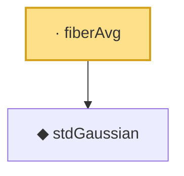

# Proof narrative — fiberAvg

Root: **fiberAvg** (private noncomputable def) `Statlib/Gaussian/Poincare.lean:523` · topic `Gaussian`
Closure: 2 declarations across 2 files. Generated from `proof_graph.json` — no files were moved.

Reading order (foundations first, headline last):

  ◆ `stdGaussian` — abbrev · `Statlib/Gaussian/Basic.lean:29`  _(also used by 97: TensorizationLSIAt, stdGaussianPi, stdGaussianPi_absolutelyContinuous, …)_
· `fiberAvg` — private noncomputable def · `Statlib/Gaussian/Poincare.lean:523` **← headline**

## Dependency diagram

