# Proof narrative — gaussian_ibp_coord

Root: **gaussian_ibp_coord** (lemma) `Statlib/Gaussian/Stein.lean:426` · topic `Gaussian`
Closure: 22 declarations across 2 files. Generated from `proof_graph.json` — no files were moved.

Reading order (foundations first, headline last):

  ◆ `stdGaussian` — abbrev · `Statlib/Gaussian/Basic.lean:29`  _(also used by 89: TensorizationLSIAt, stdGaussianPi_absolutelyContinuous, memLp_polynomial_gaussianReal, …)_
  ◆ `stdGaussianPi` — def · `Statlib/Gaussian/Basic.lean:32`  _(also used by 65: TensorizationLSIAt, GaussianSobolevRegularity, isProbabilityMeasure_stdGaussianPi, …)_
  · `lineDeriv_eq_deriv_coord` — private lemma · `Statlib/Gaussian/Stein.lean:352`
  · `lipschitz_insertNth` — private lemma · `Statlib/Gaussian/Stein.lean:376`
  · `lipschitz_memLp_gaussianReal` — private lemma · `Statlib/Gaussian/Stein.lean:84`
      · `hasDerivAt_gaussianPDFReal_std` — lemma · `Statlib/Gaussian/Basic.lean:176`  _(also used by 1: hasDerivAt_hermiteEval_mul_gaussianPDF)_
      · `integrable_id_mul_mul_gaussianPDFReal_of_memLp` — lemma · `Statlib/Gaussian/Basic.lean:94`
      · `integrable_mul_gaussianPDFReal_of_memLp` — lemma · `Statlib/Gaussian/Basic.lean:82`
    · `stein_identity` — lemma · `Statlib/Gaussian/Stein.lean:23`  _(also used by 4: integral_aeval_hermite_eq_zero, hermite_inner_succ, gaussian_dirichlet_form, …)_
    · `steklov_hasDerivAt` — private lemma · `Statlib/Gaussian/Stein.lean:61`
      · `forward_diff_tendsto` — private lemma · `Statlib/Gaussian/Stein.lean:104`
      · `backward_diff_tendsto` — private lemma · `Statlib/Gaussian/Stein.lean:114`
    · `symm_diff_quotient_tendsto` — private lemma · `Statlib/Gaussian/Stein.lean:126`
    · `steklov_sub_norm_le` — private lemma · `Statlib/Gaussian/Stein.lean:137`
    · `steklov_tendsto_pointwise` — private lemma · `Statlib/Gaussian/Stein.lean:172`
  · `stein_identity_of_lipschitz` — lemma · `Statlib/Gaussian/Stein.lean:199`
  · `update_insertNth_eq` — private lemma · `Statlib/Gaussian/Stein.lean:367`
  · `integrable_id_stdGaussianPi` — lemma · `Statlib/Gaussian/Basic.lean:195`  _(also used by 3: integrable_of_lipschitz_stdGaussianPi, entropyPi_exp_le_of_lipschitz, gaussianMollify_tendsto)_
    · `integrable_sq_coord` — private lemma · `Statlib/Gaussian/Stein.lean:390`
    · `pi_norm_sq_le_sum_sq` — private lemma · `Statlib/Gaussian/Stein.lean:400`
  · `integrable_norm_sq_stdGaussianPi` — private lemma · `Statlib/Gaussian/Stein.lean:412`
· `gaussian_ibp_coord` — lemma · `Statlib/Gaussian/Stein.lean:426` **← headline**

## Dependency diagram

```mermaid
flowchart TD
  n0["◆ stdGaussian"]
  n1["◆ stdGaussianPi"]
  n2["· lineDeriv_eq_deriv_coord"]
  n3["· lipschitz_insertNth"]
  n4["· lipschitz_memLp_gaussianReal"]
  n5["· hasDerivAt_gaussianPDFReal_std"]
  n6["· integrable_id_mul_mul_gaussianPDFReal_of_memLp"]
  n7["· integrable_mul_gaussianPDFReal_of_memLp"]
  n8["· stein_identity"]
  n9["· steklov_hasDerivAt"]
  n10["· forward_diff_tendsto"]
  n11["· backward_diff_tendsto"]
  n12["· symm_diff_quotient_tendsto"]
  n13["· steklov_sub_norm_le"]
  n14["· steklov_tendsto_pointwise"]
  n15["· stein_identity_of_lipschitz"]
  n16["· update_insertNth_eq"]
  n17["· integrable_id_stdGaussianPi"]
  n18["· integrable_sq_coord"]
  n19["· pi_norm_sq_le_sum_sq"]
  n20["· integrable_norm_sq_stdGaussianPi"]
  n21["· gaussian_ibp_coord"]
  n1 --> n0
  n4 --> n0
  n6 --> n0
  n7 --> n0
  n8 --> n0
  n8 --> n5
  n8 --> n6
  n8 --> n7
  n12 --> n10
  n12 --> n11
  n14 --> n13
  n15 --> n0
  n15 --> n8
  n15 --> n4
  n15 --> n9
  n15 --> n12
  n15 --> n13
  n15 --> n14
  n17 --> n1
  n17 --> n0
  n18 --> n1
  n18 --> n0
  n20 --> n1
  n20 --> n18
  n20 --> n19
  n21 --> n1
  n21 --> n2
  n21 --> n0
  n21 --> n3
  n21 --> n4
  n21 --> n15
  n21 --> n16
  n21 --> n17
  n21 --> n20
  class n21 headline;
  classDef headline fill:#ffe08a,stroke:#d4a017,stroke-width:2px;
  classDef axiomNode fill:#ffd0d0,stroke:#c0392b,stroke-dasharray:4 2;
```

