# Proof narrative — gaussian_poincare_1d

Root: **gaussian_poincare_1d** (theorem) `Statlib/Gaussian/Poincare.lean:485` · topic `Gaussian`
Closure: 54 declarations across 4 files. Generated from `proof_graph.json` — no files were moved.

Reading order (foundations first, headline last):

  ◆ `stdGaussian` — abbrev · `Statlib/Gaussian/Basic.lean:29`  _(also used by 57: TensorizationLSIAt, stdGaussianPi, stdGaussianPi_absolutelyContinuous, …)_
      ◆ `hermiteEval` — abbrev · `Statlib/Gaussian/Hermite.lean:60`  _(also used by 2: hermiteNorm_eq, hermite_recurrence_norm)_
      ◆ `hermiteNorm` — noncomputable def · `Statlib/Gaussian/Hermite.lean:221`  _(also used by 2: hermiteNorm_eq, hermite_recurrence_norm)_
    ◆ `hermiteCoeff` — private def · `Statlib/Gaussian/Poincare.lean:110`  _(also used by 1: summable_hermiteCoeff_sq)_
    · `hermiteCoeff_zero` — private lemma · `Statlib/Gaussian/Poincare.lean:114`
            · `memLp_pow_id_gaussianReal_aux` — private lemma · `Statlib/Gaussian/Basic.lean:112`
            · `memLp_pow_id_gaussianReal` — lemma · `Statlib/Gaussian/Basic.lean:137`  _(also used by 4: ouSemigroup_time_deriv_leibniz, ouSemigroup_lower_bound, ouSemigroup_lower_bound_Ioo, …)_
            · `memLp_polynomial_gaussianReal` — lemma · `Statlib/Gaussian/Basic.lean:142`  _(also used by 2: integrable_polynomial_mul_gaussianPDFReal, integrable_f_mul_realPoly_gaussian)_
            · `memLp_aeval_intPolynomial_gaussianReal` — lemma · `Statlib/Gaussian/Hermite.lean:45`
        · `memLp_hermiteNorm` — private lemma · `Statlib/Gaussian/Poincare.lean:124`
        · `hermiteNormLp` — private noncomputable def · `Statlib/Gaussian/Poincare.lean:279`
            · `hasDerivAt_gaussianPDFReal_std` — lemma · `Statlib/Gaussian/Basic.lean:176`
            · `integrable_id_mul_mul_gaussianPDFReal_of_memLp` — lemma · `Statlib/Gaussian/Basic.lean:94`
            · `integrable_mul_gaussianPDFReal_of_memLp` — lemma · `Statlib/Gaussian/Basic.lean:82`
            · `stein_identity` — lemma · `Statlib/Gaussian/Stein.lean:23`  _(also used by 3: gaussian_dirichlet_form, ouSemigroup_time_deriv_leibniz, stein_identity_of_lipschitz)_
            · `hasDerivAt_hermiteEval` — lemma · `Statlib/Gaussian/Hermite.lean:62`
            · `integrable_aeval_intPolynomial_gaussianReal` — lemma · `Statlib/Gaussian/Hermite.lean:54`
            ★ `integral_aeval_hermite_eq_zero` — theorem · `Statlib/Gaussian/Hermite.lean:104`
            · `memLp_hermiteEval_mul` — lemma · `Statlib/Gaussian/Hermite.lean:73`
            · `memLp_deriv_hermiteEval_mul` — lemma · `Statlib/Gaussian/Hermite.lean:81`
            · `hasDerivAt_hermiteEval_mul` — lemma · `Statlib/Gaussian/Hermite.lean:67`
            ★ `derivative_hermite` — theorem · `Statlib/Gaussian/Hermite.lean:24`  _(also used by 1: hermite_recurrence_norm)_
            ★ `hermite_inner_succ` — theorem · `Statlib/Gaussian/Hermite.lean:130`
            ★ `hermite_orthogonality` — theorem · `Statlib/Gaussian/Hermite.lean:184`
            ★ `hermiteNorm_inner` — theorem · `Statlib/Gaussian/Hermite.lean:228`
        · `real_inner_eq_mul` — private lemma · `Statlib/Gaussian/Poincare.lean:275`
          · `orthonormal_hermiteNormLp` — private lemma · `Statlib/Gaussian/Poincare.lean:283`
            · `integrable_f_mul_poly_gaussian` — lemma · `Statlib/Gaussian/Hermite.lean:293`
          · `integrable_f_mul_hermiteEval` — lemma · `Statlib/Gaussian/Hermite.lean:312`
            · `integral_poly_mul_g_of_moments_below` — private lemma · `Statlib/Gaussian/Hermite.lean:662`
            · `integrable_exp_abs_stdGaussian` — lemma · `Statlib/Gaussian/Basic.lean:237`  _(also used by 1: integrable_exp_norm_stdGaussianPi_nonneg)_
            · `integral_cexp_mul_g_eq_zero` — lemma · `Statlib/Gaussian/Hermite.lean:462`
            ★ `polynomial_dense_L2_gaussian` — theorem · `Statlib/Gaussian/Hermite.lean:553`
            ★ `hermite_span_dense_L2` — theorem · `Statlib/Gaussian/Hermite.lean:684`
          · `hermiteNormLp_orthogonal_eq_bot` — private lemma · `Statlib/Gaussian/Poincare.lean:297`
        · `hermiteBasis` — private noncomputable def · `Statlib/Gaussian/Poincare.lean:332`
      · `hermite_parseval` — private lemma · `Statlib/Gaussian/Poincare.lean:339`
        ◆ `hermiteProj` — private def · `Statlib/Gaussian/Poincare.lean:120`
        · `memLp_hermiteProj` — private lemma · `Statlib/Gaussian/Poincare.lean:133`
          · `integrable_f_mul_hermiteNorm'` — private lemma · `Statlib/Gaussian/Poincare.lean:99`
        · `integral_f_mul_hermiteProj` — private lemma · `Statlib/Gaussian/Poincare.lean:170`
            · `integrable_hermiteNorm_mul_hermiteNorm` — private lemma · `Statlib/Gaussian/Poincare.lean:140`
          · `integral_hermiteProj_mul_hermiteNorm` — private lemma · `Statlib/Gaussian/Poincare.lean:146`
        · `integral_sq_hermiteProj` — private lemma · `Statlib/Gaussian/Poincare.lean:184`
      · `hermite_bessel_finite` — private lemma · `Statlib/Gaussian/Poincare.lean:206`  _(also used by 1: summable_hermiteCoeff_sq)_
    · `hermite_parseval_tail` — private lemma · `Statlib/Gaussian/Poincare.lean:369`
          · `integral_stdGaussian_eq_integral_mul_pdf` — private lemma · `Statlib/Gaussian/Hermite.lean:349`
          · `hasDerivAt_hermiteEval_mul_gaussianPDF` — private lemma · `Statlib/Gaussian/Hermite.lean:335`
          · `integrable_mul_gaussianPDFReal_of_integrable` — private lemma · `Statlib/Gaussian/Hermite.lean:320`
        ★ `integral_deriv_mul_hermiteEval` — theorem · `Statlib/Gaussian/Hermite.lean:365`
      ★ `integral_deriv_mul_hermiteNorm` — theorem · `Statlib/Gaussian/Hermite.lean:407`
    · `hermite_coeff_f'_bound` — private lemma · `Statlib/Gaussian/Poincare.lean:389`
  ★ `gaussian_poincare_1d_core` — theorem · `Statlib/Gaussian/Poincare.lean:441`  _(also used by 2: fiber_variance_le_fiber_grad_sq, condVar_le_condExp_gradf_sq_ae_succ)_
★ `gaussian_poincare_1d` — theorem · `Statlib/Gaussian/Poincare.lean:485` **← headline**

## Dependency diagram

```mermaid
flowchart TD
  n0["◆ stdGaussian"]
  n1["◆ hermiteEval"]
  n2["◆ hermiteNorm"]
  n3["◆ hermiteCoeff"]
  n4["· hermiteCoeff_zero"]
  n5["· memLp_pow_id_gaussianReal_aux"]
  n6["· memLp_pow_id_gaussianReal"]
  n7["· memLp_polynomial_gaussianReal"]
  n8["· memLp_aeval_intPolynomial_gaussianReal"]
  n9["· memLp_hermiteNorm"]
  n10["· hermiteNormLp"]
  n11["· hasDerivAt_gaussianPDFReal_std"]
  n12["· integrable_id_mul_mul_gaussianPDFReal_of_memLp"]
  n13["· integrable_mul_gaussianPDFReal_of_memLp"]
  n14["· stein_identity"]
  n15["· hasDerivAt_hermiteEval"]
  n16["· integrable_aeval_intPolynomial_gaussianReal"]
  n17["★ integral_aeval_hermite_eq_zero"]
  n18["· memLp_hermiteEval_mul"]
  n19["· memLp_deriv_hermiteEval_mul"]
  n20["· hasDerivAt_hermiteEval_mul"]
  n21["★ derivative_hermite"]
  n22["★ hermite_inner_succ"]
  n23["★ hermite_orthogonality"]
  n24["★ hermiteNorm_inner"]
  n25["· real_inner_eq_mul"]
  n26["· orthonormal_hermiteNormLp"]
  n27["· integrable_f_mul_poly_gaussian"]
  n28["· integrable_f_mul_hermiteEval"]
  n29["· integral_poly_mul_g_of_moments_below"]
  n30["· integrable_exp_abs_stdGaussian"]
  n31["· integral_cexp_mul_g_eq_zero"]
  n32["★ polynomial_dense_L2_gaussian"]
  n33["★ hermite_span_dense_L2"]
  n34["· hermiteNormLp_orthogonal_eq_bot"]
  n35["· hermiteBasis"]
  n36["· hermite_parseval"]
  n37["◆ hermiteProj"]
  n38["· memLp_hermiteProj"]
  n39["· integrable_f_mul_hermiteNorm'"]
  n40["· integral_f_mul_hermiteProj"]
  n41["· integrable_hermiteNorm_mul_hermiteNorm"]
  n42["· integral_hermiteProj_mul_hermiteNorm"]
  n43["· integral_sq_hermiteProj"]
  n44["· hermite_bessel_finite"]
  n45["· hermite_parseval_tail"]
  n46["· integral_stdGaussian_eq_integral_mul_pdf"]
  n47["· hasDerivAt_hermiteEval_mul_gaussianPDF"]
  n48["· integrable_mul_gaussianPDFReal_of_integrable"]
  n49["★ integral_deriv_mul_hermiteEval"]
  n50["★ integral_deriv_mul_hermiteNorm"]
  n51["· hermite_coeff_f'_bound"]
  n52["★ gaussian_poincare_1d_core"]
  n53["★ gaussian_poincare_1d"]
  n2 --> n1
  n3 --> n2
  n3 --> n0
  n4 --> n3
  n4 --> n0
  n4 --> n2
  n4 --> n1
  n6 --> n5
  n7 --> n0
  n7 --> n6
  n8 --> n0
  n8 --> n7
  n9 --> n2
  n9 --> n0
  n9 --> n1
  n9 --> n8
  n10 --> n0
  n10 --> n9
  n10 --> n2
  n12 --> n0
  n13 --> n0
  n14 --> n0
  n14 --> n11
  n14 --> n12
  n14 --> n13
  n15 --> n1
  n16 --> n0
  n16 --> n8
  n17 --> n1
  n17 --> n0
  n17 --> n14
  n17 --> n8
  n17 --> n15
  n17 --> n16
  n18 --> n1
  n18 --> n0
  n18 --> n8
  n19 --> n1
  n19 --> n0
  n19 --> n8
  n20 --> n1
  n20 --> n15
  n22 --> n1
  n22 --> n0
  n22 --> n16
  n22 --> n14
  n22 --> n18
  n22 --> n19
  n22 --> n20
  n22 --> n21
  n23 --> n1
  n23 --> n0
  n23 --> n17
  n23 --> n22
  n24 --> n2
  n24 --> n0
  n24 --> n1
  n24 --> n23
  n26 --> n10
  n26 --> n24
  n26 --> n9
  n26 --> n25
  n27 --> n0
  n27 --> n8
  n28 --> n0
  n28 --> n1
  n28 --> n27
  n29 --> n0
  n29 --> n27
  n30 --> n0
  n31 --> n0
  n31 --> n27
  n31 --> n30
  n32 --> n0
  n32 --> n31
  n33 --> n0
  n33 --> n1
  n33 --> n28
  n33 --> n27
  n33 --> n29
  n33 --> n32
  n34 --> n10
  n34 --> n2
  n34 --> n0
  n34 --> n9
  n34 --> n25
  n34 --> n1
  n34 --> n33
  n35 --> n0
  n35 --> n26
  n35 --> n34
  n36 --> n0
  n36 --> n3
  n36 --> n35
  n36 --> n10
  n36 --> n9
  n36 --> n25
  n37 --> n3
  n37 --> n2
  n38 --> n37
  n38 --> n0
  n38 --> n9
  n39 --> n0
  n39 --> n2
  n39 --> n1
  n39 --> n28
  n40 --> n0
  n40 --> n37
  n40 --> n3
  n40 --> n2
  n40 --> n39
  n41 --> n2
  n41 --> n0
  n41 --> n9
  n42 --> n0
  n42 --> n37
  n42 --> n2
  n42 --> n3
  n42 --> n41
  n42 --> n24
  n43 --> n0
  n43 --> n37
  n43 --> n3
  n43 --> n2
  n43 --> n39
  n43 --> n38
  n43 --> n42
  n44 --> n0
  n44 --> n3
  n44 --> n37
  n44 --> n38
  n44 --> n40
  n44 --> n43
  n45 --> n0
  n45 --> n3
  n45 --> n36
  n45 --> n44
  n46 --> n0
  n47 --> n1
  n47 --> n15
  n47 --> n11
  n48 --> n0
  n49 --> n0
  n49 --> n1
  n49 --> n46
  n49 --> n47
  n49 --> n48
  n49 --> n28
  n50 --> n0
  n50 --> n2
  n50 --> n1
  n50 --> n49
  n51 --> n0
  n51 --> n3
  n51 --> n44
  n51 --> n50
  n52 --> n0
  n52 --> n3
  n52 --> n4
  n52 --> n45
  n52 --> n51
  n53 --> n0
  n53 --> n52
  class n53 headline;
  classDef headline fill:#ffe08a,stroke:#d4a017,stroke-width:2px;
  classDef axiomNode fill:#ffd0d0,stroke:#c0392b,stroke-dasharray:4 2;
```

