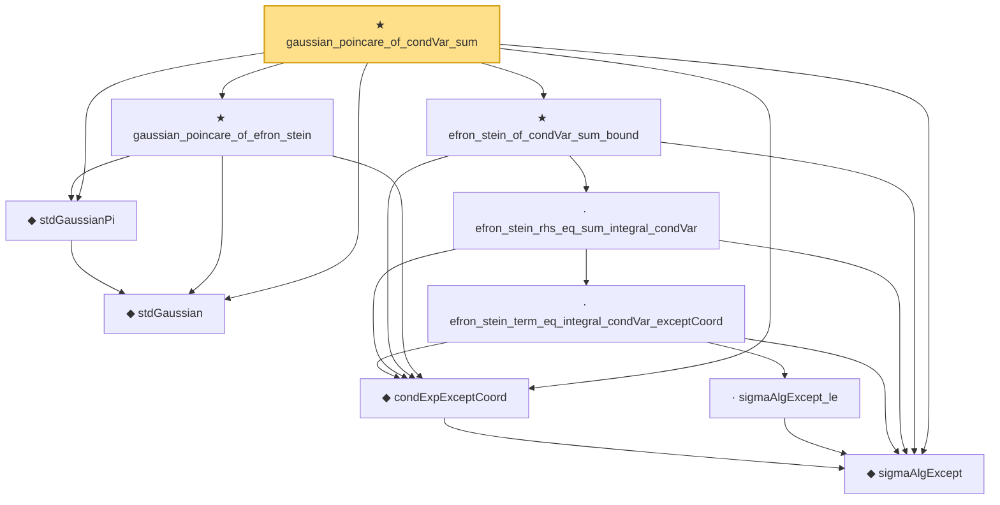

# Proof narrative — gaussian_poincare_of_condVar_sum

Root: **gaussian_poincare_of_condVar_sum** (theorem) `Statlib/Gaussian/Poincare.lean:71` · topic `Gaussian`
Closure: 10 declarations across 8 files. Generated from `proof_graph.json` — no files were moved.

Reading order (foundations first, headline last):

  ◆ `stdGaussian` — abbrev · `Statlib/Gaussian/Basic.lean:29`  _(also used by 95: TensorizationLSIAt, stdGaussianPi_absolutelyContinuous, integrable_mul_gaussianPDFReal_of_memLp, …)_
  ◆ `stdGaussianPi` — def · `Statlib/Gaussian/Basic.lean:32`  _(also used by 67: TensorizationLSIAt, GaussianSobolevRegularity, isProbabilityMeasure_stdGaussianPi, …)_
  ◆ `sigmaAlgExcept` — def · `Statlib/Variance/sigmaAlgExcept.lean:20`  _(also used by 17: condExp_eq_fiberAvg_pi, condVar_le_condExp_gradf_sq_ae_succ, condVar_le_condExp_gradf_sq_ae, …)_
  ◆ `condExpExceptCoord` — def · `Statlib/Variance/condExpExceptCoord.lean:21`  _(also used by 10: gaussian_poincare_coord_bound_core, efron_stein, efron_stein_condVar_le_of_condExp, …)_
        · `sigmaAlgExcept_le` — lemma · `Statlib/Variance/sigmaAlgExcept_le.lean:22`  _(also used by 8: condExp_eq_fiberAvg_pi, condVar_le_condExp_gradf_sq_ae_succ, gaussian_poincare_coord_bound_core, …)_
      · `efron_stein_term_eq_integral_condVar_exceptCoord` — lemma · `Statlib/Variance/efron_stein_term_eq_integral_condVar_exceptCoord.lean:22`  _(also used by 2: gaussian_poincare_coord_bound_core, efron_stein_unique_eq)_
    · `efron_stein_rhs_eq_sum_integral_condVar` — lemma · `Statlib/Variance/efron_stein_rhs_eq_sum_integral_condVar.lean:22`  _(also used by 1: efron_stein_to_condVar_sum_bound)_
  ★ `efron_stein_of_condVar_sum_bound` — theorem · `Statlib/Variance/efron_stein_of_condVar_sum_bound.lean:22`  _(also used by 2: efron_stein, efron_stein_iff_condVar_sum_bound)_
  ★ `gaussian_poincare_of_efron_stein` — theorem · `Statlib/Gaussian/Poincare.lean:44`  _(also used by 1: gaussian_poincare)_
★ `gaussian_poincare_of_condVar_sum` — theorem · `Statlib/Gaussian/Poincare.lean:71` **← headline**

## Dependency diagram

