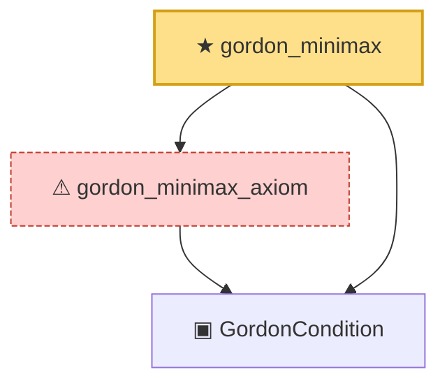

# Proof narrative — gordon_minimax

Root: **gordon_minimax** (theorem) `Statlib/Gaussian/Gordon.lean:289` · topic `Gaussian`
Closure: 3 declarations across 1 files. Generated from `proof_graph.json` — no files were moved.

Reading order (foundations first, headline last):

  ▣ `GordonCondition` — structure · `Statlib/Gaussian/Gordon.lean:165`  _(also used by 7: GordonCondition.refl, gordonCondition_of_independent, GordonCondition.var_eq_symm, …)_
  ⚠ `gordon_minimax_axiom` — axiom · `Statlib/Gaussian/Gordon.lean:274`
★ `gordon_minimax` — theorem · `Statlib/Gaussian/Gordon.lean:289` **← headline**

## Dependency diagram

