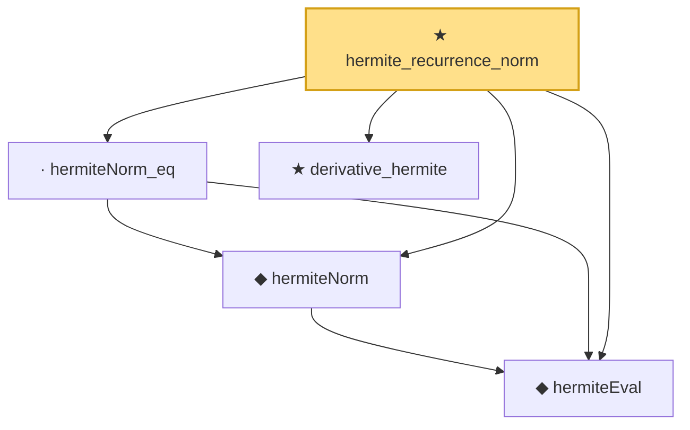

# Proof narrative — hermite_recurrence_norm

Root: **hermite_recurrence_norm** (theorem) `Statlib/Gaussian/Hermite.lean:251` · topic `Gaussian`
Closure: 5 declarations across 1 files. Generated from `proof_graph.json` — no files were moved.

Reading order (foundations first, headline last):

  ◆ `hermiteEval` — abbrev · `Statlib/Gaussian/Hermite.lean:60`  _(also used by 17: hasDerivAt_hermiteEval, hasDerivAt_hermiteEval_mul, memLp_hermiteEval_mul, …)_
  ◆ `hermiteNorm` — noncomputable def · `Statlib/Gaussian/Hermite.lean:221`  _(also used by 13: hermiteNorm_inner, integral_deriv_mul_hermiteNorm, integrable_f_mul_hermiteNorm', …)_
  · `hermiteNorm_eq` — lemma · `Statlib/Gaussian/Hermite.lean:224`
  ★ `derivative_hermite` — theorem · `Statlib/Gaussian/Hermite.lean:24`  _(also used by 1: hermite_inner_succ)_
★ `hermite_recurrence_norm` — theorem · `Statlib/Gaussian/Hermite.lean:251` **← headline**

## Dependency diagram

