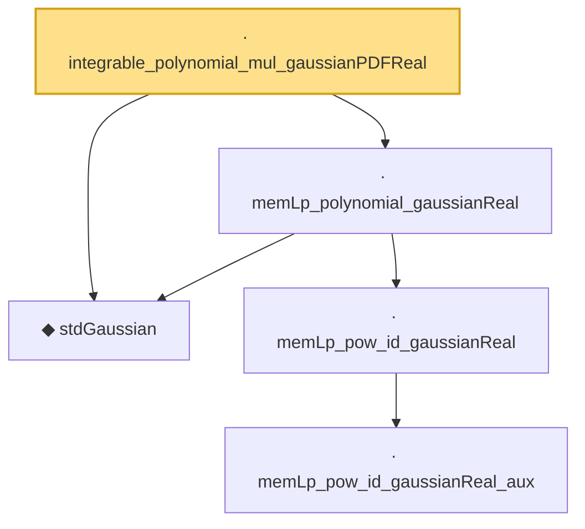

# Proof narrative — integrable_polynomial_mul_gaussianPDFReal

Root: **integrable_polynomial_mul_gaussianPDFReal** (lemma) `Statlib/Gaussian/Basic.lean:160` · topic `Gaussian`
Closure: 5 declarations across 1 files. Generated from `proof_graph.json` — no files were moved.

Reading order (foundations first, headline last):

  ◆ `stdGaussian` — abbrev · `Statlib/Gaussian/Basic.lean:29`  _(also used by 96: TensorizationLSIAt, stdGaussianPi, stdGaussianPi_absolutelyContinuous, …)_
      · `memLp_pow_id_gaussianReal_aux` — private lemma · `Statlib/Gaussian/Basic.lean:112`
    · `memLp_pow_id_gaussianReal` — lemma · `Statlib/Gaussian/Basic.lean:137`  _(also used by 4: ouSemigroup_time_deriv_leibniz, ouSemigroup_lower_bound, ouSemigroup_lower_bound_Ioo, …)_
  · `memLp_polynomial_gaussianReal` — lemma · `Statlib/Gaussian/Basic.lean:142`  _(also used by 2: memLp_aeval_intPolynomial_gaussianReal, integrable_f_mul_realPoly_gaussian)_
· `integrable_polynomial_mul_gaussianPDFReal` — lemma · `Statlib/Gaussian/Basic.lean:160` **← headline**

## Dependency diagram

