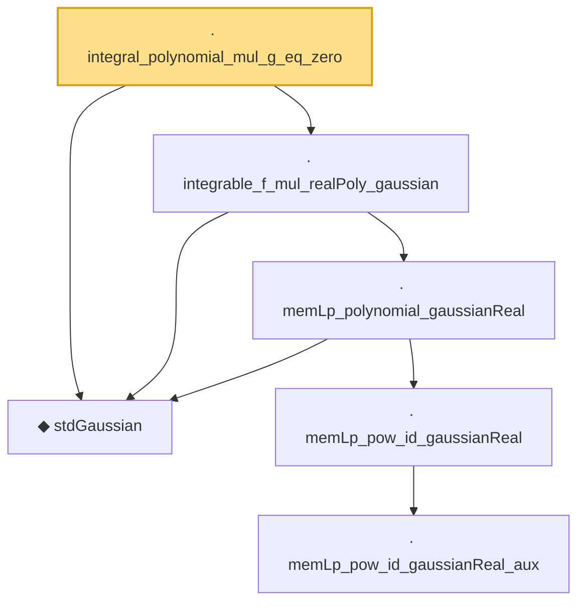

# Proof narrative — integral_polynomial_mul_g_eq_zero

Root: **integral_polynomial_mul_g_eq_zero** (lemma) `Statlib/Gaussian/Hermite.lean:437` · topic `Gaussian`
Closure: 6 declarations across 2 files. Generated from `proof_graph.json` — no files were moved.

Reading order (foundations first, headline last):

  ◆ `stdGaussian` — abbrev · `Statlib/Gaussian/Basic.lean:29`  _(also used by 95: TensorizationLSIAt, stdGaussianPi, stdGaussianPi_absolutelyContinuous, …)_
        · `memLp_pow_id_gaussianReal_aux` — private lemma · `Statlib/Gaussian/Basic.lean:112`
      · `memLp_pow_id_gaussianReal` — lemma · `Statlib/Gaussian/Basic.lean:137`  _(also used by 4: ouSemigroup_time_deriv_leibniz, ouSemigroup_lower_bound, ouSemigroup_lower_bound_Ioo, …)_
    · `memLp_polynomial_gaussianReal` — lemma · `Statlib/Gaussian/Basic.lean:142`  _(also used by 2: integrable_polynomial_mul_gaussianPDFReal, memLp_aeval_intPolynomial_gaussianReal)_
  · `integrable_f_mul_realPoly_gaussian` — lemma · `Statlib/Gaussian/Hermite.lean:303`
· `integral_polynomial_mul_g_eq_zero` — lemma · `Statlib/Gaussian/Hermite.lean:437` **← headline**

## Dependency diagram

