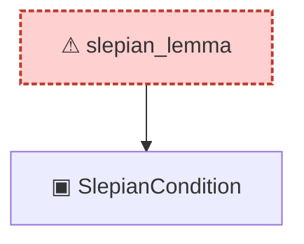

# Proof narrative — slepian_lemma

Root: **slepian_lemma** (axiom) `Statlib/Gaussian/Gordon.lean:138` · topic `Gaussian`
Closure: 2 declarations across 1 files. Generated from `proof_graph.json` — no files were moved.

Reading order (foundations first, headline last):

  ▣ `SlepianCondition` — structure · `Statlib/Gaussian/Gordon.lean:40`  _(also used by 6: SlepianCondition.symm_cov_le, SlepianCondition.refl, SlepianCondition.mean_zero_both, …)_
⚠ `slepian_lemma` — axiom · `Statlib/Gaussian/Gordon.lean:138` **← headline**

## Dependency diagram

> ⚠ `slepian_lemma` is an **axiom** (no proof body), so its closure only covers declarations referenced in its *statement*. Supporting lemmas in `Gaussian/` that were meant to prove it are not edge-connected — a signal that the proof line was atomised then axiomatised apart.
