# Proof narrative — summable_hermiteCoeff_sq

Root: **summable_hermiteCoeff_sq** (private lemma) `Statlib/Gaussian/Poincare.lean:264` · topic `Gaussian`
Closure: 34 declarations across 4 files. Generated from `proof_graph.json` — no files were moved.

Reading order (foundations first, headline last):

  ◆ `stdGaussian` — abbrev · `Statlib/Gaussian/Basic.lean:29`  _(also used by 74: TensorizationLSIAt, stdGaussianPi, stdGaussianPi_absolutelyContinuous, …)_
      ◆ `hermiteEval` — abbrev · `Statlib/Gaussian/Hermite.lean:60`  _(also used by 8: hermiteNorm_eq, hermite_recurrence_norm, hasDerivAt_hermiteEval_mul_gaussianPDF, …)_
    ◆ `hermiteNorm` — noncomputable def · `Statlib/Gaussian/Hermite.lean:221`  _(also used by 6: hermiteNorm_eq, hermite_recurrence_norm, integral_deriv_mul_hermiteNorm, …)_
  ◆ `hermiteCoeff` — private def · `Statlib/Gaussian/Poincare.lean:110`  _(also used by 5: hermiteCoeff_zero, hermite_parseval, hermite_parseval_tail, …)_
    ◆ `hermiteProj` — private def · `Statlib/Gaussian/Poincare.lean:120`
            · `memLp_pow_id_gaussianReal_aux` — private lemma · `Statlib/Gaussian/Basic.lean:112`
            · `memLp_pow_id_gaussianReal` — lemma · `Statlib/Gaussian/Basic.lean:137`  _(also used by 4: ouSemigroup_time_deriv_leibniz, ouSemigroup_lower_bound, ouSemigroup_lower_bound_Ioo, …)_
          · `memLp_polynomial_gaussianReal` — lemma · `Statlib/Gaussian/Basic.lean:142`  _(also used by 2: integrable_polynomial_mul_gaussianPDFReal, integrable_f_mul_realPoly_gaussian)_
        · `memLp_aeval_intPolynomial_gaussianReal` — lemma · `Statlib/Gaussian/Hermite.lean:45`
      · `memLp_hermiteNorm` — private lemma · `Statlib/Gaussian/Poincare.lean:124`  _(also used by 4: hermiteNormLp, orthonormal_hermiteNormLp, hermiteNormLp_orthogonal_eq_bot, …)_
    · `memLp_hermiteProj` — private lemma · `Statlib/Gaussian/Poincare.lean:133`
          · `integrable_f_mul_poly_gaussian` — lemma · `Statlib/Gaussian/Hermite.lean:293`  _(also used by 3: integral_cexp_mul_g_eq_zero, integral_poly_mul_g_of_moments_below, hermite_span_dense_L2)_
        · `integrable_f_mul_hermiteEval` — lemma · `Statlib/Gaussian/Hermite.lean:312`  _(also used by 2: integral_deriv_mul_hermiteEval, hermite_span_dense_L2)_
      · `integrable_f_mul_hermiteNorm'` — private lemma · `Statlib/Gaussian/Poincare.lean:99`
    · `integral_f_mul_hermiteProj` — private lemma · `Statlib/Gaussian/Poincare.lean:170`
        · `integrable_hermiteNorm_mul_hermiteNorm` — private lemma · `Statlib/Gaussian/Poincare.lean:140`
            · `hasDerivAt_gaussianPDFReal_std` — lemma · `Statlib/Gaussian/Basic.lean:176`  _(also used by 1: hasDerivAt_hermiteEval_mul_gaussianPDF)_
            · `integrable_id_mul_mul_gaussianPDFReal_of_memLp` — lemma · `Statlib/Gaussian/Basic.lean:94`
            · `integrable_mul_gaussianPDFReal_of_memLp` — lemma · `Statlib/Gaussian/Basic.lean:82`
            · `stein_identity` — lemma · `Statlib/Gaussian/Stein.lean:23`  _(also used by 3: gaussian_dirichlet_form, ouSemigroup_time_deriv_leibniz, stein_identity_of_lipschitz)_
            · `hasDerivAt_hermiteEval` — lemma · `Statlib/Gaussian/Hermite.lean:62`  _(also used by 1: hasDerivAt_hermiteEval_mul_gaussianPDF)_
            · `integrable_aeval_intPolynomial_gaussianReal` — lemma · `Statlib/Gaussian/Hermite.lean:54`
            ★ `integral_aeval_hermite_eq_zero` — theorem · `Statlib/Gaussian/Hermite.lean:104`
            · `memLp_hermiteEval_mul` — lemma · `Statlib/Gaussian/Hermite.lean:73`
            · `memLp_deriv_hermiteEval_mul` — lemma · `Statlib/Gaussian/Hermite.lean:81`
            · `hasDerivAt_hermiteEval_mul` — lemma · `Statlib/Gaussian/Hermite.lean:67`
            ★ `derivative_hermite` — theorem · `Statlib/Gaussian/Hermite.lean:24`  _(also used by 1: hermite_recurrence_norm)_
            ★ `hermite_inner_succ` — theorem · `Statlib/Gaussian/Hermite.lean:130`
          ★ `hermite_orthogonality` — theorem · `Statlib/Gaussian/Hermite.lean:184`
        ★ `hermiteNorm_inner` — theorem · `Statlib/Gaussian/Hermite.lean:228`  _(also used by 1: orthonormal_hermiteNormLp)_
      · `integral_hermiteProj_mul_hermiteNorm` — private lemma · `Statlib/Gaussian/Poincare.lean:146`
    · `integral_sq_hermiteProj` — private lemma · `Statlib/Gaussian/Poincare.lean:184`
  · `hermite_bessel_finite` — private lemma · `Statlib/Gaussian/Poincare.lean:206`  _(also used by 2: hermite_parseval_tail, hermite_coeff_f'_bound)_
· `summable_hermiteCoeff_sq` — private lemma · `Statlib/Gaussian/Poincare.lean:264` **← headline**

## Dependency diagram

```mermaid
flowchart TD
  n0["◆ stdGaussian"]
  n1["◆ hermiteEval"]
  n2["◆ hermiteNorm"]
  n3["◆ hermiteCoeff"]
  n4["◆ hermiteProj"]
  n5["· memLp_pow_id_gaussianReal_aux"]
  n6["· memLp_pow_id_gaussianReal"]
  n7["· memLp_polynomial_gaussianReal"]
  n8["· memLp_aeval_intPolynomial_gaussianReal"]
  n9["· memLp_hermiteNorm"]
  n10["· memLp_hermiteProj"]
  n11["· integrable_f_mul_poly_gaussian"]
  n12["· integrable_f_mul_hermiteEval"]
  n13["· integrable_f_mul_hermiteNorm'"]
  n14["· integral_f_mul_hermiteProj"]
  n15["· integrable_hermiteNorm_mul_hermiteNorm"]
  n16["· hasDerivAt_gaussianPDFReal_std"]
  n17["· integrable_id_mul_mul_gaussianPDFReal_of_memLp"]
  n18["· integrable_mul_gaussianPDFReal_of_memLp"]
  n19["· stein_identity"]
  n20["· hasDerivAt_hermiteEval"]
  n21["· integrable_aeval_intPolynomial_gaussianReal"]
  n22["★ integral_aeval_hermite_eq_zero"]
  n23["· memLp_hermiteEval_mul"]
  n24["· memLp_deriv_hermiteEval_mul"]
  n25["· hasDerivAt_hermiteEval_mul"]
  n26["★ derivative_hermite"]
  n27["★ hermite_inner_succ"]
  n28["★ hermite_orthogonality"]
  n29["★ hermiteNorm_inner"]
  n30["· integral_hermiteProj_mul_hermiteNorm"]
  n31["· integral_sq_hermiteProj"]
  n32["· hermite_bessel_finite"]
  n33["· summable_hermiteCoeff_sq"]
  n2 --> n1
  n3 --> n2
  n3 --> n0
  n4 --> n3
  n4 --> n2
  n6 --> n5
  n7 --> n0
  n7 --> n6
  n8 --> n0
  n8 --> n7
  n9 --> n2
  n9 --> n0
  n9 --> n1
  n9 --> n8
  n10 --> n4
  n10 --> n0
  n10 --> n9
  n11 --> n0
  n11 --> n8
  n12 --> n0
  n12 --> n1
  n12 --> n11
  n13 --> n0
  n13 --> n2
  n13 --> n1
  n13 --> n12
  n14 --> n0
  n14 --> n4
  n14 --> n3
  n14 --> n2
  n14 --> n13
  n15 --> n2
  n15 --> n0
  n15 --> n9
  n17 --> n0
  n18 --> n0
  n19 --> n0
  n19 --> n16
  n19 --> n17
  n19 --> n18
  n20 --> n1
  n21 --> n0
  n21 --> n8
  n22 --> n1
  n22 --> n0
  n22 --> n19
  n22 --> n8
  n22 --> n20
  n22 --> n21
  n23 --> n1
  n23 --> n0
  n23 --> n8
  n24 --> n1
  n24 --> n0
  n24 --> n8
  n25 --> n1
  n25 --> n20
  n27 --> n1
  n27 --> n0
  n27 --> n21
  n27 --> n19
  n27 --> n23
  n27 --> n24
  n27 --> n25
  n27 --> n26
  n28 --> n1
  n28 --> n0
  n28 --> n22
  n28 --> n27
  n29 --> n2
  n29 --> n0
  n29 --> n1
  n29 --> n28
  n30 --> n0
  n30 --> n4
  n30 --> n2
  n30 --> n3
  n30 --> n15
  n30 --> n29
  n31 --> n0
  n31 --> n4
  n31 --> n3
  n31 --> n2
  n31 --> n13
  n31 --> n10
  n31 --> n30
  n32 --> n0
  n32 --> n3
  n32 --> n4
  n32 --> n10
  n32 --> n14
  n32 --> n31
  n33 --> n0
  n33 --> n3
  n33 --> n32
  class n33 headline;
  classDef headline fill:#ffe08a,stroke:#d4a017,stroke-width:2px;
  classDef axiomNode fill:#ffd0d0,stroke:#c0392b,stroke-dasharray:4 2;
```

