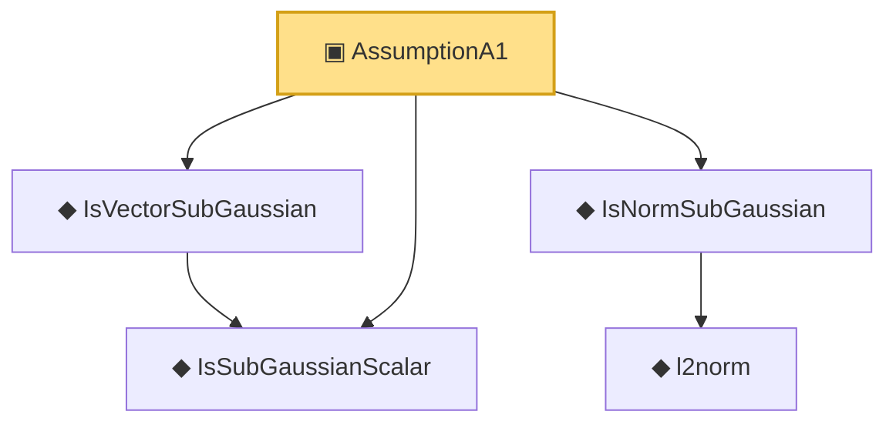

# Proof narrative — AssumptionA1

Root: **AssumptionA1** (structure) `Statlib/HDMediation/AssumptionA1.lean:22` · topic `HDMediation`
Closure: 5 declarations across 5 files. Generated from `proof_graph.json` — no files were moved.

Reading order (foundations first, headline last):

  ◆ `IsSubGaussianScalar` — def · `Statlib/HDMediation/IsSubGaussianScalar.lean:20`
  ◆ `IsVectorSubGaussian` — def · `Statlib/HDMediation/IsVectorSubGaussian.lean:19`
    ◆ `l2norm` — noncomputable def · `Statlib/HDMediation/l2norm.lean:17`
  ◆ `IsNormSubGaussian` — def · `Statlib/HDMediation/IsNormSubGaussian.lean:19`
▣ `AssumptionA1` — structure · `Statlib/HDMediation/AssumptionA1.lean:22` **← headline**

## Dependency diagram

