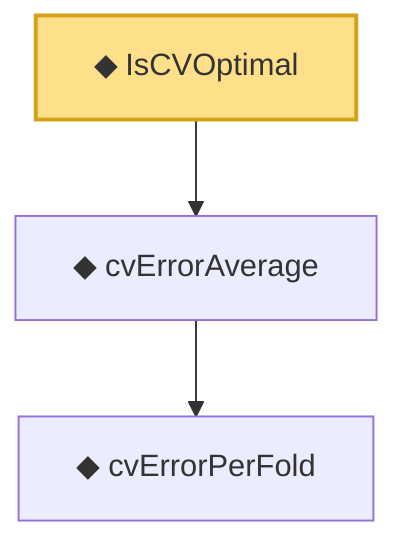

# Proof narrative — IsCVOptimal

Root: **IsCVOptimal** (def) `Statlib/HDStats/IsCVOptimal.lean:15` · topic `HDStats`
Closure: 3 declarations across 3 files. Generated from `proof_graph.json` — no files were moved.

Reading order (foundations first, headline last):

    ◆ `cvErrorPerFold` — noncomputable def · `Statlib/HDStats/cvErrorPerFold.lean:13`  _(also used by 1: cvErrorPerFold_nonneg)_
  ◆ `cvErrorAverage` — noncomputable def · `Statlib/HDStats/cvErrorAverage.lean:11`  _(also used by 1: cvErrorAverage_nonneg)_
◆ `IsCVOptimal` — def · `Statlib/HDStats/IsCVOptimal.lean:15` **← headline**

## Dependency diagram

