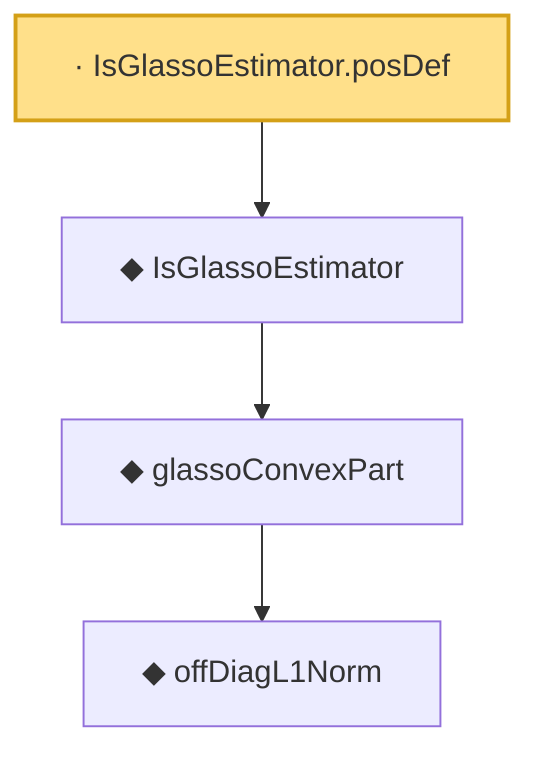

# Proof narrative — IsGlassoEstimator.posDef

Root: **IsGlassoEstimator.posDef** (lemma) `Statlib/HDStats/IsGlassoEstimator_posDef.lean:12` · topic `HDStats`
Closure: 4 declarations across 4 files. Generated from `proof_graph.json` — no files were moved.

Reading order (foundations first, headline last):

      ◆ `offDiagL1Norm` — def · `Statlib/HDStats/offDiagL1Norm.lean:13`  _(also used by 3: glassoConvexPart_penalty_nonneg, offDiagL1Norm_diagonal, offDiagL1Norm_nonneg)_
    ◆ `glassoConvexPart` — noncomputable def · `Statlib/HDStats/glassoConvexPart.lean:19`  _(also used by 1: IsGlassoEstimator.le)_
  ◆ `IsGlassoEstimator` — def · `Statlib/HDStats/IsGlassoEstimator.lean:17`  _(also used by 1: IsGlassoEstimator.le)_
· `IsGlassoEstimator.posDef` — lemma · `Statlib/HDStats/IsGlassoEstimator_posDef.lean:12` **← headline**

## Dependency diagram

