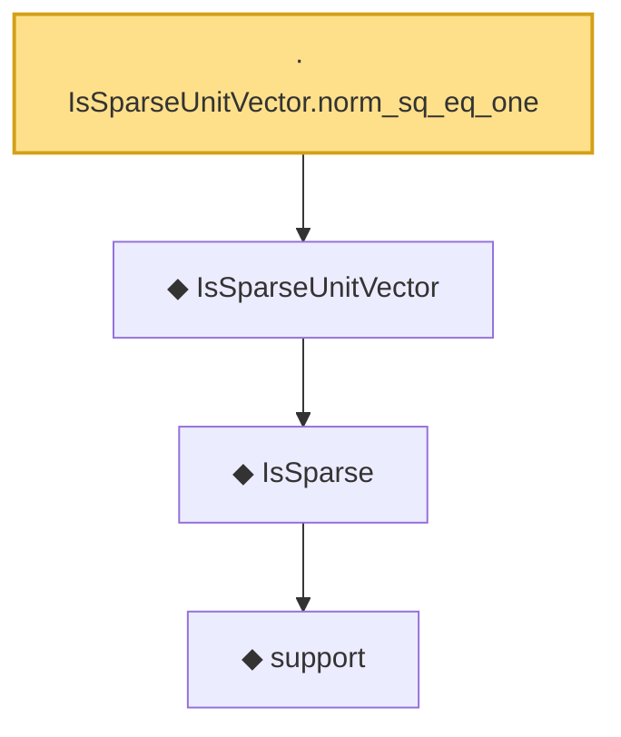

# Proof narrative — IsSparseUnitVector.norm_sq_eq_one

Root: **IsSparseUnitVector.norm_sq_eq_one** (lemma) `Statlib/HDStats/IsSparseUnitVector_norm_sq_eq_one.lean:9` · topic `HDStats`
Closure: 4 declarations across 3 files. Generated from `proof_graph.json` — no files were moved.

Reading order (foundations first, headline last):

      ◆ `support` — noncomputable def · `Statlib/HDStats/Basic.lean:51`  _(also used by 4: isSparse_iff_card_support, support_smul_subset, lasso_l2_error_on_support, …)_
    ◆ `IsSparse` — def · `Statlib/HDStats/Basic.lean:56`  _(also used by 14: IsBestSSparseApprox, IsBestSSparseApprox_self_of_sparse, IsIhtStep.isSparse, …)_
  ◆ `IsSparseUnitVector` — def · `Statlib/HDStats/IsSparseUnitVector.lean:10`  _(also used by 6: IsSparseUnitVector.isSparse, IsSparseUnitVector.mono, sparsePcaObjective, …)_
· `IsSparseUnitVector.norm_sq_eq_one` — lemma · `Statlib/HDStats/IsSparseUnitVector_norm_sq_eq_one.lean:9` **← headline**

## Dependency diagram

