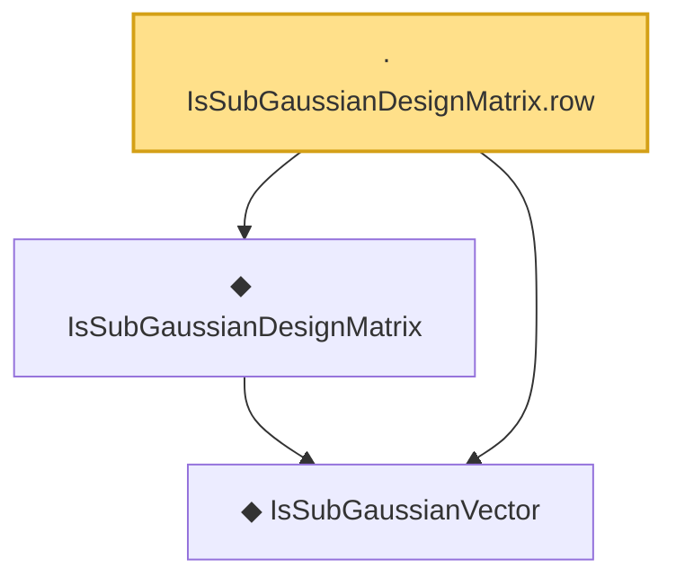

# Proof narrative — IsSubGaussianDesignMatrix.row

Root: **IsSubGaussianDesignMatrix.row** (lemma) `Statlib/HDStats/Basic.lean:149` · topic `HDStats`
Closure: 3 declarations across 1 files. Generated from `proof_graph.json` — no files were moved.

Reading order (foundations first, headline last):

  ◆ `IsSubGaussianVector` — def · `Statlib/HDStats/Basic.lean:136`
  ◆ `IsSubGaussianDesignMatrix` — def · `Statlib/HDStats/Basic.lean:144`
· `IsSubGaussianDesignMatrix.row` — lemma · `Statlib/HDStats/Basic.lean:149` **← headline**

## Dependency diagram

