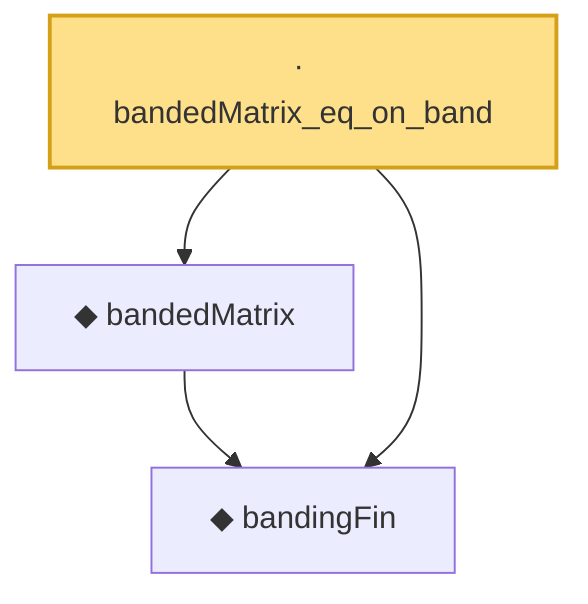

# Proof narrative — bandedMatrix_eq_on_band

Root: **bandedMatrix_eq_on_band** (lemma) `Statlib/HDStats/bandedMatrix_eq_on_band.lean:12` · topic `HDStats`
Closure: 3 declarations across 3 files. Generated from `proof_graph.json` — no files were moved.

Reading order (foundations first, headline last):

  ◆ `bandingFin` — def · `Statlib/HDStats/bandingFin.lean:11`  _(also used by 4: bandedMatrix_zero_bandwidth, bandedMatrix_zero_off_band, bandingFin_decidable, …)_
  ◆ `bandedMatrix` — noncomputable def · `Statlib/HDStats/bandedMatrix.lean:12`  _(also used by 3: bandedMatrix_preserves_diagonal, bandedMatrix_zero_bandwidth, bandedMatrix_zero_off_band)_
· `bandedMatrix_eq_on_band` — lemma · `Statlib/HDStats/bandedMatrix_eq_on_band.lean:12` **← headline**

## Dependency diagram

