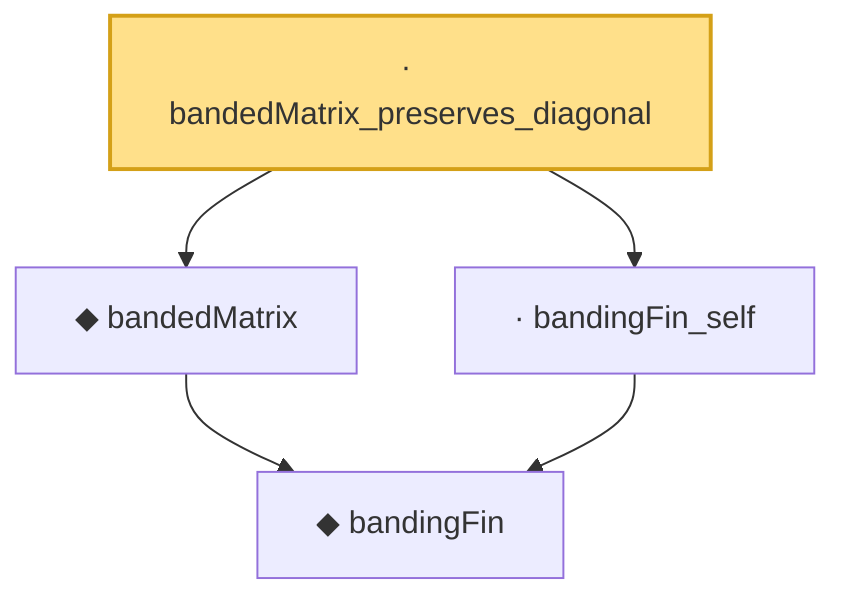

# Proof narrative — bandedMatrix_preserves_diagonal

Root: **bandedMatrix_preserves_diagonal** (lemma) `Statlib/HDStats/bandedMatrix_preserves_diagonal.lean:12` · topic `HDStats`
Closure: 4 declarations across 4 files. Generated from `proof_graph.json` — no files were moved.

Reading order (foundations first, headline last):

    ◆ `bandingFin` — def · `Statlib/HDStats/bandingFin.lean:11`  _(also used by 4: bandedMatrix_eq_on_band, bandedMatrix_zero_bandwidth, bandedMatrix_zero_off_band, …)_
  ◆ `bandedMatrix` — noncomputable def · `Statlib/HDStats/bandedMatrix.lean:12`  _(also used by 3: bandedMatrix_eq_on_band, bandedMatrix_zero_bandwidth, bandedMatrix_zero_off_band)_
  · `bandingFin_self` — lemma · `Statlib/HDStats/bandingFin_self.lean:12`
· `bandedMatrix_preserves_diagonal` — lemma · `Statlib/HDStats/bandedMatrix_preserves_diagonal.lean:12` **← headline**

## Dependency diagram

