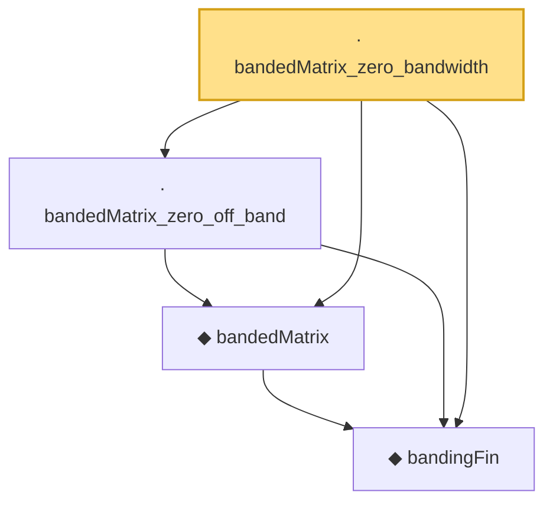

# Proof narrative — bandedMatrix_zero_bandwidth

Root: **bandedMatrix_zero_bandwidth** (lemma) `Statlib/HDStats/bandedMatrix_zero_bandwidth.lean:14` · topic `HDStats`
Closure: 4 declarations across 4 files. Generated from `proof_graph.json` — no files were moved.

Reading order (foundations first, headline last):

  ◆ `bandingFin` — def · `Statlib/HDStats/bandingFin.lean:11`  _(also used by 3: bandedMatrix_eq_on_band, bandingFin_decidable, bandingFin_self)_
  ◆ `bandedMatrix` — noncomputable def · `Statlib/HDStats/bandedMatrix.lean:12`  _(also used by 2: bandedMatrix_eq_on_band, bandedMatrix_preserves_diagonal)_
  · `bandedMatrix_zero_off_band` — lemma · `Statlib/HDStats/bandedMatrix_zero_off_band.lean:12`
· `bandedMatrix_zero_bandwidth` — lemma · `Statlib/HDStats/bandedMatrix_zero_bandwidth.lean:14` **← headline**

## Dependency diagram

