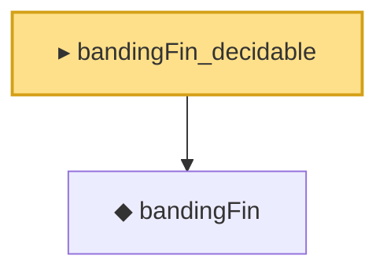

# Proof narrative — bandingFin_decidable

Root: **bandingFin_decidable** (instance) `Statlib/HDStats/bandingFin_decidable.lean:9` · topic `HDStats`
Closure: 2 declarations across 2 files. Generated from `proof_graph.json` — no files were moved.

Reading order (foundations first, headline last):

  ◆ `bandingFin` — def · `Statlib/HDStats/bandingFin.lean:11`  _(also used by 5: bandedMatrix, bandedMatrix_eq_on_band, bandedMatrix_zero_bandwidth, …)_
▸ `bandingFin_decidable` — instance · `Statlib/HDStats/bandingFin_decidable.lean:9` **← headline**

## Dependency diagram

