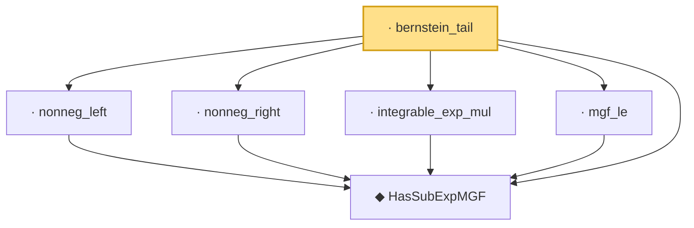

# Proof narrative — bernstein_tail

Root: **bernstein_tail** (lemma) `Statlib/HDStats/bernstein_tail.lean:24` · topic `HDStats`
Closure: 6 declarations across 6 files. Generated from `proof_graph.json` — no files were moved.

Reading order (foundations first, headline last):

  ◆ `HasSubExpMGF` — def · `Statlib/HDStats/HasSubExpMGF.lean:16`  _(also used by 3: const_smul, mgf_add_const, zero)_
  · `nonneg_left` — lemma · `Statlib/HDStats/nonneg_left.lean:11`
  · `nonneg_right` — lemma · `Statlib/HDStats/nonneg_right.lean:11`
  · `integrable_exp_mul` — lemma · `Statlib/HDStats/integrable_exp_mul.lean:11`
  · `mgf_le` — lemma · `Statlib/HDStats/mgf_le.lean:11`  _(also used by 1: mgf_add_const)_
· `bernstein_tail` — lemma · `Statlib/HDStats/bernstein_tail.lean:24` **← headline**

## Dependency diagram

