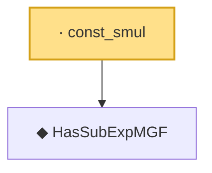

# Proof narrative — const_smul

Root: **const_smul** (lemma) `Statlib/HDStats/const_smul.lean:12` · topic `HDStats`
Closure: 2 declarations across 2 files. Generated from `proof_graph.json` — no files were moved.

Reading order (foundations first, headline last):

  ◆ `HasSubExpMGF` — def · `Statlib/HDStats/HasSubExpMGF.lean:16`  _(also used by 7: bernstein_tail, integrable_exp_mul, mgf_add_const, …)_
· `const_smul` — lemma · `Statlib/HDStats/const_smul.lean:12` **← headline**

## Dependency diagram

