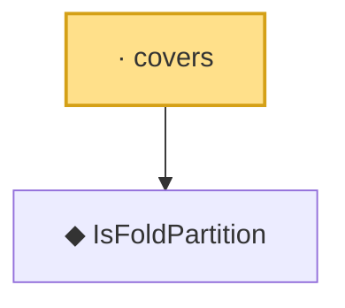

# Proof narrative — covers

Root: **covers** (lemma) `Statlib/HDStats/covers.lean:11` · topic `HDStats`
Closure: 2 declarations across 2 files. Generated from `proof_graph.json` — no files were moved.

Reading order (foundations first, headline last):

  ◆ `IsFoldPartition` — def · `Statlib/HDStats/IsFoldPartition.lean:11`  _(also used by 2: disjoint, unique_fold)_
· `covers` — lemma · `Statlib/HDStats/covers.lean:11` **← headline**

## Dependency diagram

