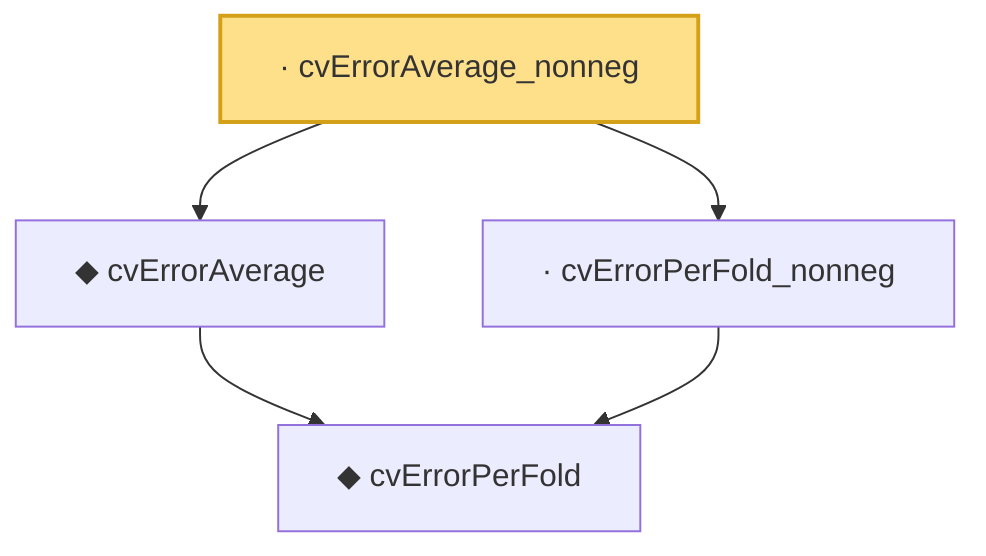

# Proof narrative — cvErrorAverage_nonneg

Root: **cvErrorAverage_nonneg** (lemma) `Statlib/HDStats/cvErrorAverage_nonneg.lean:12` · topic `HDStats`
Closure: 4 declarations across 4 files. Generated from `proof_graph.json` — no files were moved.

Reading order (foundations first, headline last):

    ◆ `cvErrorPerFold` — noncomputable def · `Statlib/HDStats/cvErrorPerFold.lean:13`
  ◆ `cvErrorAverage` — noncomputable def · `Statlib/HDStats/cvErrorAverage.lean:11`  _(also used by 1: IsCVOptimal)_
  · `cvErrorPerFold_nonneg` — lemma · `Statlib/HDStats/cvErrorPerFold_nonneg.lean:11`
· `cvErrorAverage_nonneg` — lemma · `Statlib/HDStats/cvErrorAverage_nonneg.lean:12` **← headline**

## Dependency diagram

