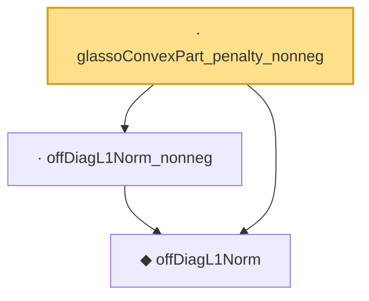

# Proof narrative — glassoConvexPart_penalty_nonneg

Root: **glassoConvexPart_penalty_nonneg** (lemma) `Statlib/HDStats/glassoConvexPart_penalty_nonneg.lean:14` · topic `HDStats`
Closure: 3 declarations across 3 files. Generated from `proof_graph.json` — no files were moved.

Reading order (foundations first, headline last):

  ◆ `offDiagL1Norm` — def · `Statlib/HDStats/offDiagL1Norm.lean:13`  _(also used by 2: glassoConvexPart, offDiagL1Norm_diagonal)_
  · `offDiagL1Norm_nonneg` — lemma · `Statlib/HDStats/offDiagL1Norm_nonneg.lean:11`
· `glassoConvexPart_penalty_nonneg` — lemma · `Statlib/HDStats/glassoConvexPart_penalty_nonneg.lean:14` **← headline**

## Dependency diagram

