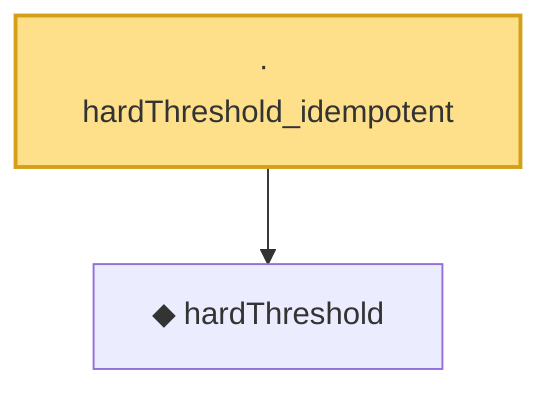

# Proof narrative — hardThreshold_idempotent

Root: **hardThreshold_idempotent** (lemma) `Statlib/HDStats/hardThreshold_idempotent.lean:15` · topic `HDStats`
Closure: 2 declarations across 2 files. Generated from `proof_graph.json` — no files were moved.

Reading order (foundations first, headline last):

  ◆ `hardThreshold` — noncomputable def · `Statlib/HDStats/hardThreshold.lean:13`  _(also used by 5: hardThreshold_above_threshold, hardThreshold_abs_le, hardThreshold_below_threshold, …)_
· `hardThreshold_idempotent` — lemma · `Statlib/HDStats/hardThreshold_idempotent.lean:15` **← headline**

## Dependency diagram

