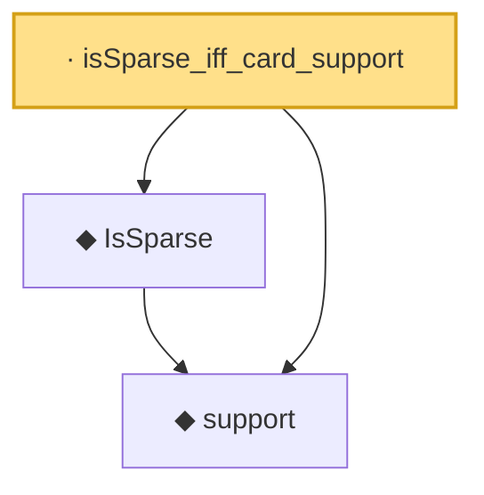

# Proof narrative — isSparse_iff_card_support

Root: **isSparse_iff_card_support** (lemma) `Statlib/HDStats/Basic.lean:72` · topic `HDStats`
Closure: 3 declarations across 1 files. Generated from `proof_graph.json` — no files were moved.

Reading order (foundations first, headline last):

  ◆ `support` — noncomputable def · `Statlib/HDStats/Basic.lean:51`  _(also used by 3: support_smul_subset, lasso_l2_error_on_support, lasso_slow_rate)_
  ◆ `IsSparse` — def · `Statlib/HDStats/Basic.lean:56`  _(also used by 14: IsBestSSparseApprox, IsBestSSparseApprox_self_of_sparse, IsIhtStep.isSparse, …)_
· `isSparse_iff_card_support` — lemma · `Statlib/HDStats/Basic.lean:72` **← headline**

## Dependency diagram

