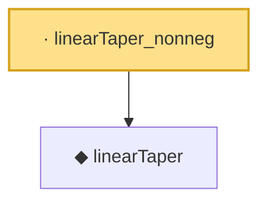

# Proof narrative — linearTaper_nonneg

Root: **linearTaper_nonneg** (lemma) `Statlib/HDStats/linearTaper_nonneg.lean:9` · topic `HDStats`
Closure: 2 declarations across 2 files. Generated from `proof_graph.json` — no files were moved.

Reading order (foundations first, headline last):

  ◆ `linearTaper` — noncomputable def · `Statlib/HDStats/linearTaper.lean:11`  _(also used by 3: linearTaper_close, linearTaper_far, linearTaper_le_one)_
· `linearTaper_nonneg` — lemma · `Statlib/HDStats/linearTaper_nonneg.lean:9` **← headline**

## Dependency diagram

