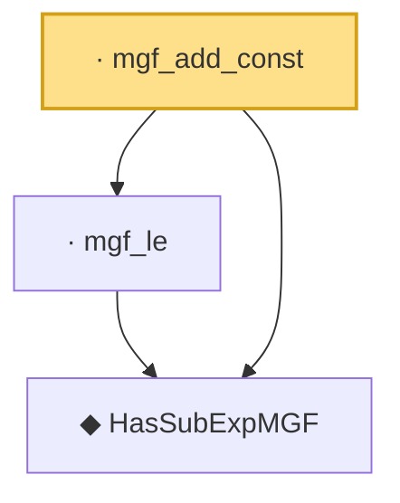

# Proof narrative — mgf_add_const

Root: **mgf_add_const** (lemma) `Statlib/HDStats/mgf_add_const.lean:16` · topic `HDStats`
Closure: 3 declarations across 3 files. Generated from `proof_graph.json` — no files were moved.

Reading order (foundations first, headline last):

  ◆ `HasSubExpMGF` — def · `Statlib/HDStats/HasSubExpMGF.lean:16`  _(also used by 6: bernstein_tail, const_smul, integrable_exp_mul, …)_
  · `mgf_le` — lemma · `Statlib/HDStats/mgf_le.lean:11`  _(also used by 1: bernstein_tail)_
· `mgf_add_const` — lemma · `Statlib/HDStats/mgf_add_const.lean:16` **← headline**

## Dependency diagram

