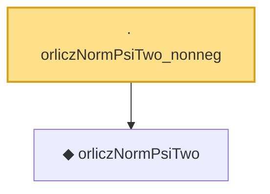

# Proof narrative — orliczNormPsiTwo_nonneg

Root: **orliczNormPsiTwo_nonneg** (lemma) `Statlib/HDStats/Basic.lean:112` · topic `HDStats`
Closure: 2 declarations across 1 files. Generated from `proof_graph.json` — no files were moved.

Reading order (foundations first, headline last):

  ◆ `orliczNormPsiTwo` — noncomputable def · `Statlib/HDStats/Basic.lean:106`
· `orliczNormPsiTwo_nonneg` — lemma · `Statlib/HDStats/Basic.lean:112` **← headline**

## Dependency diagram

