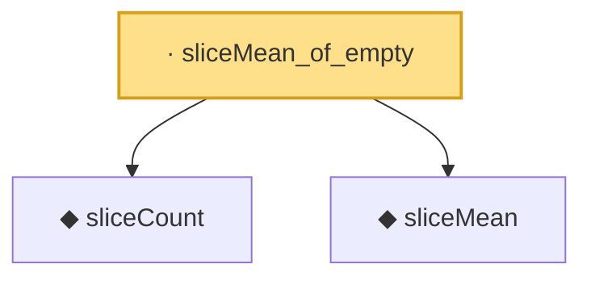

# Proof narrative — sliceMean_of_empty

Root: **sliceMean_of_empty** (lemma) `Statlib/HDStats/sliceMean_of_empty.lean:10` · topic `HDStats`
Closure: 3 declarations across 3 files. Generated from `proof_graph.json` — no files were moved.

Reading order (foundations first, headline last):

  ◆ `sliceCount` — noncomputable def · `Statlib/HDStats/sliceCount.lean:9`  _(also used by 2: sliceCount_le_n, sliceProportion)_
  ◆ `sliceMean` — noncomputable def · `Statlib/HDStats/sliceMean.lean:10`
· `sliceMean_of_empty` — lemma · `Statlib/HDStats/sliceMean_of_empty.lean:10` **← headline**

## Dependency diagram

