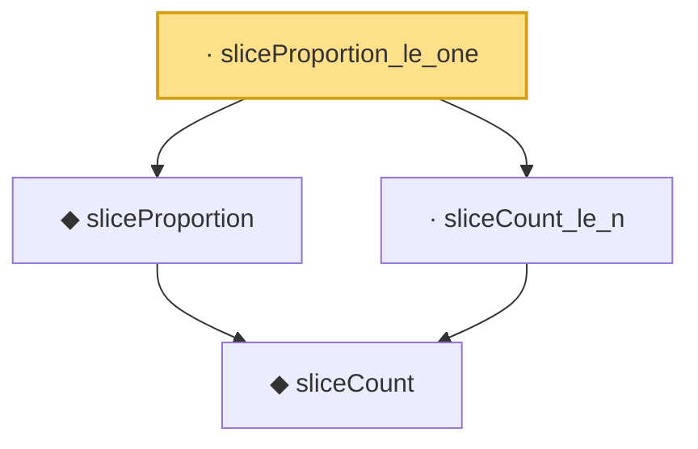

# Proof narrative — sliceProportion_le_one

Root: **sliceProportion_le_one** (lemma) `Statlib/HDStats/sliceProportion_le_one.lean:10` · topic `HDStats`
Closure: 4 declarations across 4 files. Generated from `proof_graph.json` — no files were moved.

Reading order (foundations first, headline last):

    ◆ `sliceCount` — noncomputable def · `Statlib/HDStats/sliceCount.lean:9`  _(also used by 1: sliceMean_of_empty)_
  ◆ `sliceProportion` — noncomputable def · `Statlib/HDStats/sliceProportion.lean:9`  _(also used by 1: sliceProportion_nonneg)_
  · `sliceCount_le_n` — lemma · `Statlib/HDStats/sliceCount_le_n.lean:8`
· `sliceProportion_le_one` — lemma · `Statlib/HDStats/sliceProportion_le_one.lean:10` **← headline**

## Dependency diagram

