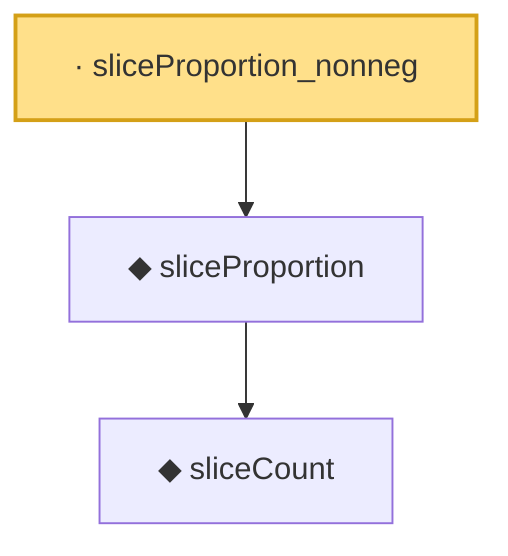

# Proof narrative — sliceProportion_nonneg

Root: **sliceProportion_nonneg** (lemma) `Statlib/HDStats/sliceProportion_nonneg.lean:8` · topic `HDStats`
Closure: 3 declarations across 3 files. Generated from `proof_graph.json` — no files were moved.

Reading order (foundations first, headline last):

    ◆ `sliceCount` — noncomputable def · `Statlib/HDStats/sliceCount.lean:9`  _(also used by 2: sliceCount_le_n, sliceMean_of_empty)_
  ◆ `sliceProportion` — noncomputable def · `Statlib/HDStats/sliceProportion.lean:9`  _(also used by 1: sliceProportion_le_one)_
· `sliceProportion_nonneg` — lemma · `Statlib/HDStats/sliceProportion_nonneg.lean:8` **← headline**

## Dependency diagram

