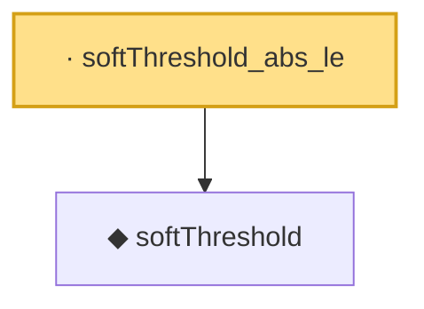

# Proof narrative — softThreshold_abs_le

Root: **softThreshold_abs_le** (lemma) `Statlib/HDStats/softThreshold_abs_le.lean:9` · topic `HDStats`
Closure: 2 declarations across 2 files. Generated from `proof_graph.json` — no files were moved.

Reading order (foundations first, headline last):

  ◆ `softThreshold` — noncomputable def · `Statlib/HDStats/softThreshold.lean:12`  _(also used by 3: softThresholdVec, softThreshold_eq_zero_iff, softThreshold_neg)_
· `softThreshold_abs_le` — lemma · `Statlib/HDStats/softThreshold_abs_le.lean:9` **← headline**

## Dependency diagram

