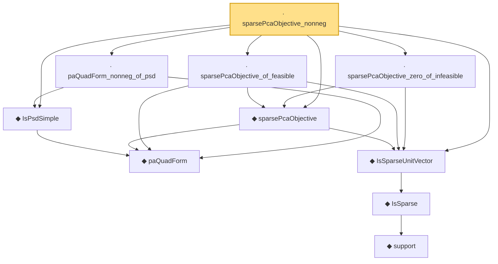

# Proof narrative — sparsePcaObjective_nonneg

Root: **sparsePcaObjective_nonneg** (lemma) `Statlib/HDStats/sparsePcaObjective_nonneg.lean:14` · topic `HDStats`
Closure: 10 declarations across 9 files. Generated from `proof_graph.json` — no files were moved.

Reading order (foundations first, headline last):

    ◆ `paQuadForm` — def · `Statlib/HDStats/paQuadForm.lean:9`
  ◆ `IsPsdSimple` — def · `Statlib/HDStats/IsPsdSimple.lean:12`
        ◆ `support` — noncomputable def · `Statlib/HDStats/Basic.lean:51`  _(also used by 4: isSparse_iff_card_support, support_smul_subset, lasso_l2_error_on_support, …)_
      ◆ `IsSparse` — def · `Statlib/HDStats/Basic.lean:56`  _(also used by 14: IsBestSSparseApprox, IsBestSSparseApprox_self_of_sparse, IsIhtStep.isSparse, …)_
  ◆ `IsSparseUnitVector` — def · `Statlib/HDStats/IsSparseUnitVector.lean:10`  _(also used by 3: IsSparseUnitVector.isSparse, IsSparseUnitVector.mono, IsSparseUnitVector.norm_sq_eq_one)_
  ◆ `sparsePcaObjective` — noncomputable def · `Statlib/HDStats/sparsePcaObjective.lean:12`
  · `sparsePcaObjective_of_feasible` — lemma · `Statlib/HDStats/sparsePcaObjective_of_feasible.lean:12`
  · `paQuadForm_nonneg_of_psd` — lemma · `Statlib/HDStats/paQuadForm_nonneg_of_psd.lean:10`
  · `sparsePcaObjective_zero_of_infeasible` — lemma · `Statlib/HDStats/sparsePcaObjective_zero_of_infeasible.lean:10`
· `sparsePcaObjective_nonneg` — lemma · `Statlib/HDStats/sparsePcaObjective_nonneg.lean:14` **← headline**

## Dependency diagram

