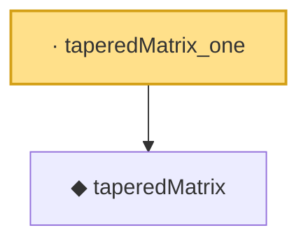

# Proof narrative — taperedMatrix_one

Root: **taperedMatrix_one** (lemma) `Statlib/HDStats/taperedMatrix_one.lean:11` · topic `HDStats`
Closure: 2 declarations across 2 files. Generated from `proof_graph.json` — no files were moved.

Reading order (foundations first, headline last):

  ◆ `taperedMatrix` — noncomputable def · `Statlib/HDStats/taperedMatrix.lean:11`  _(also used by 2: taperedMatrix_preserves_diagonal, taperedMatrix_zero)_
· `taperedMatrix_one` — lemma · `Statlib/HDStats/taperedMatrix_one.lean:11` **← headline**

## Dependency diagram

