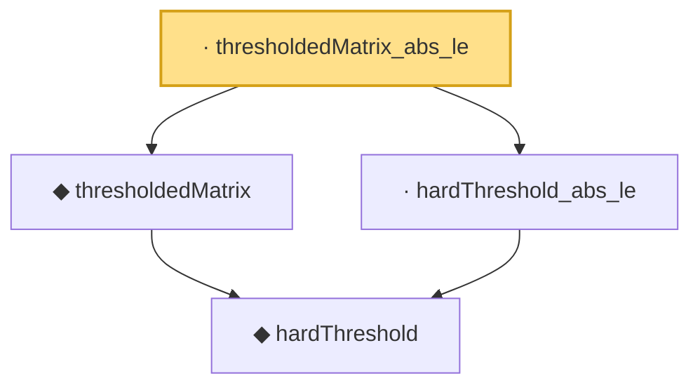

# Proof narrative — thresholdedMatrix_abs_le

Root: **thresholdedMatrix_abs_le** (lemma) `Statlib/HDStats/thresholdedMatrix_abs_le.lean:12` · topic `HDStats`
Closure: 4 declarations across 4 files. Generated from `proof_graph.json` — no files were moved.

Reading order (foundations first, headline last):

    ◆ `hardThreshold` — noncomputable def · `Statlib/HDStats/hardThreshold.lean:13`  _(also used by 4: hardThreshold_above_threshold, hardThreshold_below_threshold, hardThreshold_idempotent, …)_
  ◆ `thresholdedMatrix` — noncomputable def · `Statlib/HDStats/thresholdedMatrix.lean:13`  _(also used by 2: thresholdedMatrix_eq_of_large, thresholdedMatrix_eq_zero_of_small)_
  · `hardThreshold_abs_le` — lemma · `Statlib/HDStats/hardThreshold_abs_le.lean:11`
· `thresholdedMatrix_abs_le` — lemma · `Statlib/HDStats/thresholdedMatrix_abs_le.lean:12` **← headline**

## Dependency diagram

