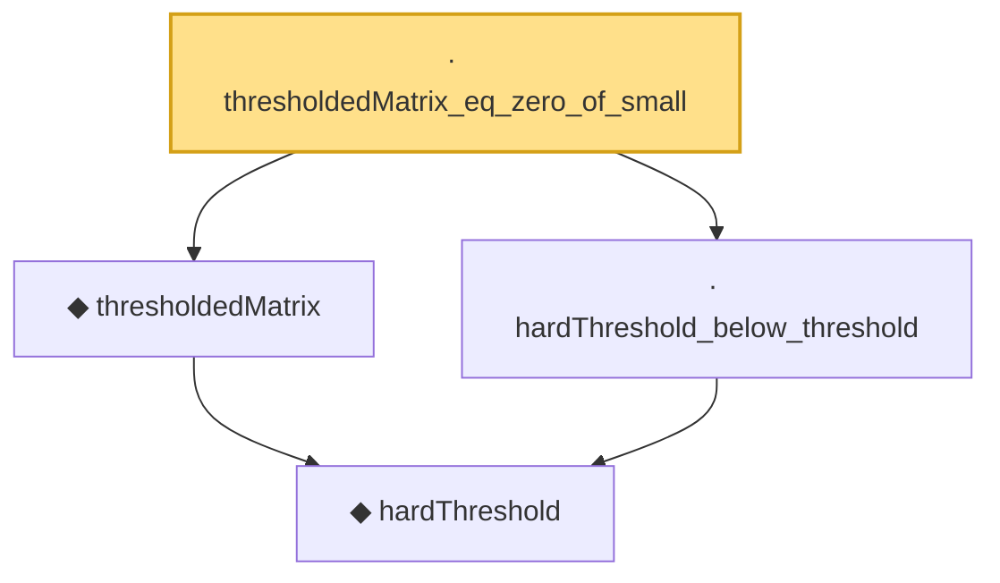

# Proof narrative — thresholdedMatrix_eq_zero_of_small

Root: **thresholdedMatrix_eq_zero_of_small** (lemma) `Statlib/HDStats/thresholdedMatrix_eq_zero_of_small.lean:11` · topic `HDStats`
Closure: 4 declarations across 4 files. Generated from `proof_graph.json` — no files were moved.

Reading order (foundations first, headline last):

    ◆ `hardThreshold` — noncomputable def · `Statlib/HDStats/hardThreshold.lean:13`  _(also used by 4: hardThreshold_above_threshold, hardThreshold_abs_le, hardThreshold_idempotent, …)_
  ◆ `thresholdedMatrix` — noncomputable def · `Statlib/HDStats/thresholdedMatrix.lean:13`  _(also used by 2: thresholdedMatrix_abs_le, thresholdedMatrix_eq_of_large)_
  · `hardThreshold_below_threshold` — lemma · `Statlib/HDStats/hardThreshold_below_threshold.lean:10`
· `thresholdedMatrix_eq_zero_of_small` — lemma · `Statlib/HDStats/thresholdedMatrix_eq_zero_of_small.lean:11` **← headline**

## Dependency diagram

