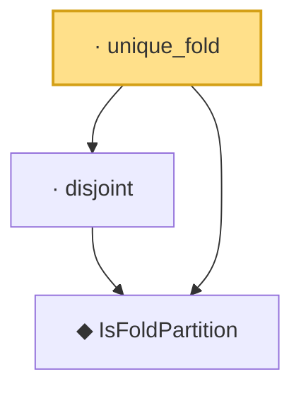

# Proof narrative — unique_fold

Root: **unique_fold** (lemma) `Statlib/HDStats/unique_fold.lean:14` · topic `HDStats`
Closure: 3 declarations across 3 files. Generated from `proof_graph.json` — no files were moved.

Reading order (foundations first, headline last):

  ◆ `IsFoldPartition` — def · `Statlib/HDStats/IsFoldPartition.lean:11`  _(also used by 1: covers)_
  · `disjoint` — lemma · `Statlib/HDStats/disjoint.lean:11`
· `unique_fold` — lemma · `Statlib/HDStats/unique_fold.lean:14` **← headline**

## Dependency diagram

