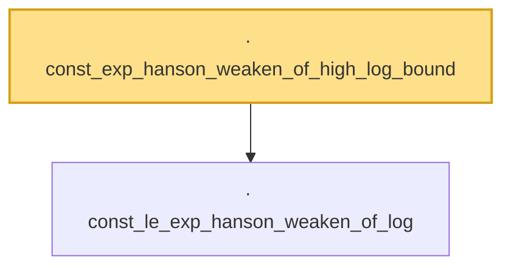

# Proof narrative — const_exp_hanson_weaken_of_high_log_bound

Root: **const_exp_hanson_weaken_of_high_log_bound** (lemma) `Statlib/HighDim/Concentration/HansonWright.lean:1661` · topic `HighDim`
Closure: 2 declarations across 1 files. Generated from `proof_graph.json` — no files were moved.

Reading order (foundations first, headline last):

  · `const_le_exp_hanson_weaken_of_log` — lemma · `Statlib/HighDim/Concentration/HansonWright.lean:1639`  _(also used by 1: const_mul_exp_neg_le_exp_neg_hanson_weaken_of_log)_
· `const_exp_hanson_weaken_of_high_log_bound` — lemma · `Statlib/HighDim/Concentration/HansonWright.lean:1661` **← headline**

## Dependency diagram

