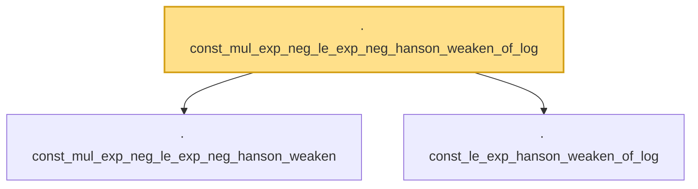

# Proof narrative — const_mul_exp_neg_le_exp_neg_hanson_weaken_of_log

Root: **const_mul_exp_neg_le_exp_neg_hanson_weaken_of_log** (lemma) `Statlib/HighDim/Concentration/HansonWright.lean:1695` · topic `HighDim`
Closure: 3 declarations across 1 files. Generated from `proof_graph.json` — no files were moved.

Reading order (foundations first, headline last):

  · `const_mul_exp_neg_le_exp_neg_hanson_weaken` — lemma · `Statlib/HighDim/Concentration/HansonWright.lean:1673`  _(also used by 2: zeroDiag_centered_quadratic_form_tail_high_of_const_decoupling_absorb, zeroDiag_centered_quadratic_form_tail_high_of_const_decoupling_norm_bernstein_absorb)_
  · `const_le_exp_hanson_weaken_of_log` — lemma · `Statlib/HighDim/Concentration/HansonWright.lean:1688`  _(also used by 1: const_exp_hanson_weaken_of_high_log_bound)_
· `const_mul_exp_neg_le_exp_neg_hanson_weaken_of_log` — lemma · `Statlib/HighDim/Concentration/HansonWright.lean:1695` **← headline**

## Dependency diagram

