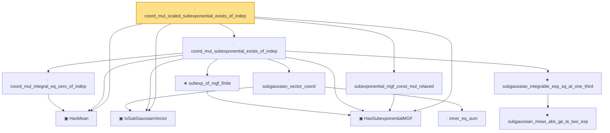

# Proof narrative — coord_mul_scaled_subexponential_exists_of_indep

Root: **coord_mul_scaled_subexponential_exists_of_indep** (lemma) `Statlib/HighDim/Concentration/HansonWright.lean:1880` · topic `HighDim`
Closure: 12 declarations across 7 files. Generated from `proof_graph.json` — no files were moved.

Reading order (foundations first, headline last):

  ▣ `HasMean` — structure · `Statlib/HighDim/Vocabulary/RandomVector.lean:83`  _(also used by 36: offDiagQuadForm_integral_eq_zero_of_indep, offDiagQuadForm_centered_eq_self_of_indep, offdiag_tail_of_zeroDiag_centered_quad_tail, …)_
  ▣ `IsSubGaussianVector` — structure · `Statlib/HighDim/Vocabulary/RandomVector.lean:52`  _(also used by 76: decoupledOffDiagQuadForm_const_right_subgaussian, decoupledOffDiagQuadForm_const_right_abs_tail_real, decoupledOffDiagQuadForm_prod_first_section_abs_tail_real, …)_
  ▣ `HasSubexponentialMGF` — structure · `Statlib/StatFoundation/Vocabulary/RandomVariable.lean:74`  _(also used by 29: subexponential_mgf_mono_sigma, subexponential_mgf_mono_b, coord_sq_centered_scaled_subexponential_explicit_of_range, …)_
      · `inner_eq_sum` — lemma · `Statlib/HighDim/Vocabulary/Norms.lean:32`  _(also used by 15: decoupledOffDiagQuadForm_eq_inner_coeff, offDiagCoeffVec_apply_eq_inner_row_zeroDiag, subgaussian_norm_sq_mean_le_dim, …)_
    · `subgaussian_vector_coord` — lemma · `Statlib/HighDim/Concentration/HansonWright.lean:1341`  _(also used by 18: coord_sq_centered_mgf_bound, coord_sq_centered_mgf_bound_explicit, coord_sq_centered_scaled_exp_integrable, …)_
      ★ `subgaussian_meas_abs_ge_le_two_exp` — theorem · `Statlib/StatFoundation/RandomVariable/SubGaussian/subgaussian_meas_abs_ge_le_two_exp.lean:9`  _(also used by 4: subgaussian_linf_tail, lasso_noise_condition, subgaussian_even_moment_le, …)_
    ★ `subgaussian_integrable_exp_sq_at_one_third` — theorem · `Statlib/StatFoundation/RandomVariable/SubGaussian/subgaussian_exp_sq_le_at_one_third.lean:165`  _(also used by 5: coord_sq_centered_scaled_exp_integrable, coord_sq_centered_subexponential_exists, design_noise_inner_subexponential, …)_
    · `coord_mul_integral_eq_zero_of_indep` — lemma · `Statlib/HighDim/Concentration/HansonWright.lean:1249`  _(also used by 1: offDiagQuadForm_integral_eq_zero_of_indep)_
    ★ `subexp_of_mgf_finite` — theorem · `Statlib/StatFoundation/RandomVariable/SubExponential/subexp_of_mgf_finite.lean:20`  _(also used by 1: coord_sq_centered_subexponential_exists)_
  · `coord_mul_subexponential_exists_of_indep` — lemma · `Statlib/HighDim/Concentration/HansonWright.lean:1367`
  · `subexponential_mgf_const_mul_relaxed` — lemma · `Statlib/HighDim/Concentration/HansonWright.lean:1827`
· `coord_mul_scaled_subexponential_exists_of_indep` — lemma · `Statlib/HighDim/Concentration/HansonWright.lean:1880` **← headline**

## Dependency diagram

