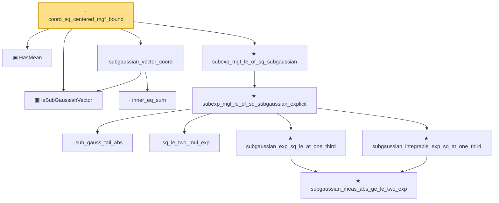

# Proof narrative — coord_sq_centered_mgf_bound

Root: **coord_sq_centered_mgf_bound** (lemma) `Statlib/HighDim/Concentration/HansonWright.lean:2021` · topic `HighDim`
Closure: 12 declarations across 7 files. Generated from `proof_graph.json` — no files were moved.

Reading order (foundations first, headline last):

  ▣ `HasMean` — structure · `Statlib/HighDim/Vocabulary/RandomVector.lean:83`  _(also used by 60: coord_mul_integral_eq_zero_of_indep, offDiagQuadForm_integral_eq_zero_of_indep, offDiagQuadForm_centered_eq_self_of_indep, …)_
  ▣ `IsSubGaussianVector` — structure · `Statlib/HighDim/Vocabulary/RandomVector.lean:52`  _(also used by 75: decoupledOffDiagQuadForm_const_right_subgaussian, decoupledOffDiagQuadForm_const_right_abs_tail_real, decoupledOffDiagQuadForm_prod_first_section_abs_tail_real, …)_
    · `inner_eq_sum` — lemma · `Statlib/HighDim/Vocabulary/Norms.lean:32`  _(also used by 13: decoupledOffDiagQuadForm_eq_inner_coeff, offDiagCoeffVec_apply_eq_inner_row_zeroDiag, subgaussian_norm_sq_mean_le_dim, …)_
  · `subgaussian_vector_coord` — lemma · `Statlib/HighDim/Concentration/HansonWright.lean:1389`  _(also used by 17: coord_mul_subexponential_exists_of_indep, coord_sq_centered_mgf_bound_explicit, coord_sq_centered_scaled_exp_integrable, …)_
      · `sub_gauss_tail_abs` — lemma · `Statlib/StatFoundation/RandomVariable/SubExponential/subexp_mgf_le_of_sq_subgaussian.lean:13`  _(also used by 1: sub_gauss_tail_sq)_
      · `sq_le_two_mul_exp` — lemma · `Statlib/StatFoundation/RandomVariable/SubGaussian/sq_le_two_mul_exp.lean:10`
        ★ `subgaussian_meas_abs_ge_le_two_exp` — theorem · `Statlib/StatFoundation/RandomVariable/SubGaussian/subgaussian_meas_abs_ge_le_two_exp.lean:9`  _(also used by 3: subgaussian_linf_tail, lasso_noise_condition, subgaussian_even_moment_le)_
      ★ `subgaussian_exp_sq_le_at_one_third` — theorem · `Statlib/StatFoundation/RandomVariable/SubGaussian/subgaussian_exp_sq_le_at_one_third.lean:14`
      ★ `subgaussian_integrable_exp_sq_at_one_third` — theorem · `Statlib/StatFoundation/RandomVariable/SubGaussian/subgaussian_exp_sq_le_at_one_third.lean:166`  _(also used by 3: coord_mul_subexponential_exists_of_indep, coord_sq_centered_scaled_exp_integrable, coord_sq_centered_subexponential_exists)_
    ★ `subexp_mgf_le_of_sq_subgaussian_explicit` — theorem · `Statlib/StatFoundation/RandomVariable/SubExponential/subexp_mgf_le_of_sq_subgaussian.lean:72`  _(also used by 2: coord_sq_centered_mgf_bound_explicit, scalar_sq_centered_subexponential_explicit)_
  ★ `subexp_mgf_le_of_sq_subgaussian` — theorem · `Statlib/StatFoundation/RandomVariable/SubExponential/subexp_mgf_le_of_sq_subgaussian.lean:1224`
· `coord_sq_centered_mgf_bound` — lemma · `Statlib/HighDim/Concentration/HansonWright.lean:2021` **← headline**

## Dependency diagram

