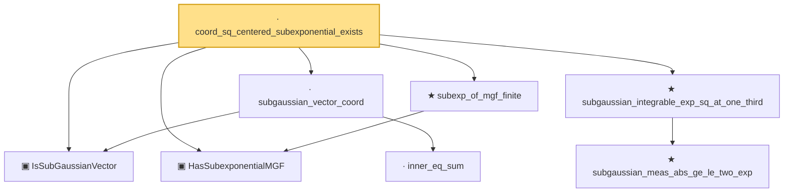

# Proof narrative — coord_sq_centered_subexponential_exists

Root: **coord_sq_centered_subexponential_exists** (lemma) `Statlib/HighDim/Concentration/HansonWright.lean:2753` · topic `HighDim`
Closure: 8 declarations across 7 files. Generated from `proof_graph.json` — no files were moved.

Reading order (foundations first, headline last):

  ▣ `IsSubGaussianVector` — structure · `Statlib/HighDim/Vocabulary/RandomVector.lean:52`  _(also used by 78: decoupledOffDiagQuadForm_const_right_subgaussian, decoupledOffDiagQuadForm_const_right_abs_tail_real, decoupledOffDiagQuadForm_prod_first_section_abs_tail_real, …)_
  ▣ `HasSubexponentialMGF` — structure · `Statlib/StatFoundation/Vocabulary/RandomVariable.lean:74`  _(also used by 29: coord_mul_subexponential_exists_of_indep, subexponential_mgf_const_mul_relaxed, coord_mul_scaled_subexponential_exists_of_indep, …)_
    · `inner_eq_sum` — lemma · `Statlib/HighDim/Vocabulary/Norms.lean:32`  _(also used by 13: decoupledOffDiagQuadForm_eq_inner_coeff, offDiagCoeffVec_apply_eq_inner_row_zeroDiag, subgaussian_norm_sq_mean_le_dim, …)_
  · `subgaussian_vector_coord` — lemma · `Statlib/HighDim/Concentration/HansonWright.lean:1340`  _(also used by 18: coord_mul_subexponential_exists_of_indep, coord_sq_centered_mgf_bound, coord_sq_centered_mgf_bound_explicit, …)_
    ★ `subgaussian_meas_abs_ge_le_two_exp` — theorem · `Statlib/StatFoundation/RandomVariable/SubGaussian/subgaussian_meas_abs_ge_le_two_exp.lean:9`  _(also used by 4: subgaussian_linf_tail, lasso_noise_condition, subgaussian_even_moment_le, …)_
  ★ `subgaussian_integrable_exp_sq_at_one_third` — theorem · `Statlib/StatFoundation/RandomVariable/SubGaussian/subgaussian_exp_sq_le_at_one_third.lean:165`  _(also used by 5: coord_mul_subexponential_exists_of_indep, coord_sq_centered_scaled_exp_integrable, design_noise_inner_subexponential, …)_
  ★ `subexp_of_mgf_finite` — theorem · `Statlib/StatFoundation/RandomVariable/SubExponential/subexp_of_mgf_finite.lean:19`  _(also used by 1: coord_mul_subexponential_exists_of_indep)_
· `coord_sq_centered_subexponential_exists` — lemma · `Statlib/HighDim/Concentration/HansonWright.lean:2753` **← headline**

## Dependency diagram

