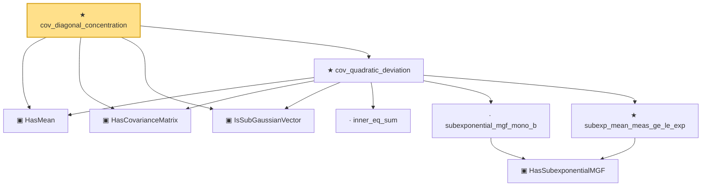

# Proof narrative — cov_diagonal_concentration

Root: **cov_diagonal_concentration** (theorem) `Statlib/HighDim/CovarianceMatrix/CovDiagonalConcentration.lean:20` · topic `HighDim`
Closure: 9 declarations across 7 files. Generated from `proof_graph.json` — no files were moved.

Reading order (foundations first, headline last):

  ▣ `HasMean` — structure · `Statlib/HighDim/Vocabulary/RandomVector.lean:83`  _(also used by 37: coord_mul_integral_eq_zero_of_indep, offDiagQuadForm_integral_eq_zero_of_indep, offDiagQuadForm_centered_eq_self_of_indep, …)_
  ▣ `HasCovarianceMatrix` — structure · `Statlib/HighDim/Vocabulary/RandomVector.lean:101`  _(also used by 20: cov_trace_concentration, secondMoment_isSymm, secondMoment_posSemidef, …)_
  ▣ `IsSubGaussianVector` — structure · `Statlib/HighDim/Vocabulary/RandomVector.lean:52`  _(also used by 77: decoupledOffDiagQuadForm_const_right_subgaussian, decoupledOffDiagQuadForm_const_right_abs_tail_real, decoupledOffDiagQuadForm_prod_first_section_abs_tail_real, …)_
    · `inner_eq_sum` — lemma · `Statlib/HighDim/Vocabulary/Norms.lean:32`  _(also used by 15: decoupledOffDiagQuadForm_eq_inner_coeff, offDiagCoeffVec_apply_eq_inner_row_zeroDiag, subgaussian_vector_coord, …)_
      ▣ `HasSubexponentialMGF` — structure · `Statlib/StatFoundation/Vocabulary/RandomVariable.lean:74`  _(also used by 31: coord_mul_subexponential_exists_of_indep, subexponential_mgf_const_mul_relaxed, coord_mul_scaled_subexponential_exists_of_indep, …)_
    · `subexponential_mgf_mono_b` — lemma · `Statlib/HighDim/Concentration/HansonWright.lean:1916`
    ★ `subexp_mean_meas_ge_le_exp` — theorem · `Statlib/StatFoundation/Concentration/ExponentialType/subexp_mean_meas_ge_le_exp.lean:11`
  ★ `cov_quadratic_deviation` — theorem · `Statlib/HighDim/CovarianceMatrix/CovQuadraticDeviation.lean:24`
★ `cov_diagonal_concentration` — theorem · `Statlib/HighDim/CovarianceMatrix/CovDiagonalConcentration.lean:20` **← headline**

## Dependency diagram

