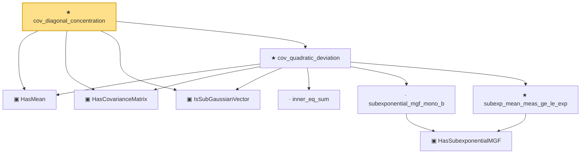

# Proof narrative — cov_diagonal_concentration

Root: **cov_diagonal_concentration** (theorem) `Statlib/HighDim/CovarianceMatrix/CovDiagonalConcentration.lean:20` · topic `HighDim`
Closure: 9 declarations across 7 files. Generated from `proof_graph.json` — no files were moved.

Reading order (foundations first, headline last):

  ▣ `HasMean` — structure · `Statlib/HighDim/Vocabulary/RandomVector.lean:83`  _(also used by 123: frobenius_norm_sq_subgaussian_concentration, gaussian_quadratic_form_concentration, coord_mul_integral_eq_zero_of_indep, …)_
  ▣ `HasCovarianceMatrix` — structure · `Statlib/HighDim/Vocabulary/RandomVector.lean:101`  _(also used by 116: cov_quadratic_deviation_uniform_const, cov_quadratic_deviation_unit_lower_tail, cov_quadratic_deviation_unit_shifted_lower_tail, …)_
  ▣ `IsSubGaussianVector` — structure · `Statlib/HighDim/Vocabulary/RandomVector.lean:52`  _(also used by 174: frobenius_norm_sq_subgaussian_concentration, gaussian_quadratic_form_concentration, decoupledOffDiagQuadForm_const_right_subgaussian, …)_
    · `inner_eq_sum` — lemma · `Statlib/HighDim/Vocabulary/Norms.lean:100`  _(also used by 20: decoupledOffDiagQuadForm_eq_inner_coeff, offDiagCoeffVec_apply_eq_inner_row_zeroDiag, subgaussian_vector_coord, …)_
      ▣ `HasSubexponentialMGF` — structure · `Statlib/StatFoundation/Vocabulary/RandomVariable.lean:74`  _(also used by 31: coord_mul_subexponential_exists_of_indep, subexponential_mgf_const_mul_relaxed, coord_mul_scaled_subexponential_exists_of_indep, …)_
    · `subexponential_mgf_mono_b` — lemma · `Statlib/HighDim/Concentration/HansonWright.lean:1916`  _(also used by 1: cov_quadratic_deviation_uniform_const)_
    ★ `subexp_mean_meas_ge_le_exp` — theorem · `Statlib/StatFoundation/Concentration/ExponentialType/subexp_mean_meas_ge_le_exp.lean:11`  _(also used by 1: cov_quadratic_deviation_uniform_const)_
  ★ `cov_quadratic_deviation` — theorem · `Statlib/HighDim/CovarianceMatrix/CovQuadraticDeviation.lean:25`
★ `cov_diagonal_concentration` — theorem · `Statlib/HighDim/CovarianceMatrix/CovDiagonalConcentration.lean:20` **← headline**

## Dependency diagram

```mermaid
flowchart TD
  n0["▣ HasMean"]
  n1["▣ HasCovarianceMatrix"]
  n2["▣ IsSubGaussianVector"]
  n3["· inner_eq_sum"]
  n4["▣ HasSubexponentialMGF"]
  n5["· subexponential_mgf_mono_b"]
  n6["★ subexp_mean_meas_ge_le_exp"]
  n7["★ cov_quadratic_deviation"]
  n8["★ cov_diagonal_concentration"]
  n5 --> n4
  n6 --> n4
  n7 --> n0
  n7 --> n1
  n7 --> n2
  n7 --> n3
  n7 --> n5
  n7 --> n6
  n8 --> n0
  n8 --> n1
  n8 --> n2
  n8 --> n7
  class n8 headline;
  classDef headline fill:#ffe08a,stroke:#d4a017,stroke-width:2px;
  classDef axiomNode fill:#ffd0d0,stroke:#c0392b,stroke-dasharray:4 2;
```
