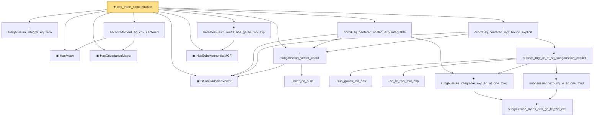

# Proof narrative — cov_trace_concentration

Root: **cov_trace_concentration** (theorem) `Statlib/HighDim/CovarianceMatrix/CovTraceConcentration.lean:36` · topic `HighDim`
Closure: 18 declarations across 12 files. Generated from `proof_graph.json` — no files were moved.

Reading order (foundations first, headline last):

  ▣ `HasMean` — structure · `Statlib/HighDim/Vocabulary/RandomVector.lean:83`  _(also used by 37: coord_mul_integral_eq_zero_of_indep, offDiagQuadForm_integral_eq_zero_of_indep, offDiagQuadForm_centered_eq_self_of_indep, …)_
  ▣ `HasCovarianceMatrix` — structure · `Statlib/HighDim/Vocabulary/RandomVector.lean:101`  _(also used by 19: cov_diagonal_concentration, cov_quadratic_deviation, secondMoment_isSymm, …)_
  ▣ `IsSubGaussianVector` — structure · `Statlib/HighDim/Vocabulary/RandomVector.lean:52`  _(also used by 76: decoupledOffDiagQuadForm_const_right_subgaussian, decoupledOffDiagQuadForm_const_right_abs_tail_real, decoupledOffDiagQuadForm_prod_first_section_abs_tail_real, …)_
    · `inner_eq_sum` — lemma · `Statlib/HighDim/Vocabulary/Norms.lean:32`  _(also used by 13: decoupledOffDiagQuadForm_eq_inner_coeff, offDiagCoeffVec_apply_eq_inner_row_zeroDiag, subgaussian_norm_sq_mean_le_dim, …)_
  · `subgaussian_vector_coord` — lemma · `Statlib/HighDim/Concentration/HansonWright.lean:1340`  _(also used by 16: coord_mul_subexponential_exists_of_indep, coord_sq_centered_mgf_bound, weighted_coord_sq_centered_sum_tail_explicit, …)_
  · `subgaussian_integral_eq_zero` — lemma · `Statlib/StatFoundation/RandomVariable/SubGaussian/subgaussian_integral_eq_zero.lean:12`  _(also used by 2: subgaussianVector_hasMean_zero, subgaussian_prod_subexponential)_
  · `secondMoment_eq_cov_centered` — lemma · `Statlib/HighDim/CovarianceMatrix/Properties.lean:115`
  ▣ `HasSubexponentialMGF` — structure · `Statlib/StatFoundation/Vocabulary/RandomVariable.lean:74`  _(also used by 29: coord_mul_subexponential_exists_of_indep, subexponential_mgf_const_mul_relaxed, coord_mul_scaled_subexponential_exists_of_indep, …)_
      · `sub_gauss_tail_abs` — lemma · `Statlib/StatFoundation/RandomVariable/SubExponential/subexp_mgf_le_of_sq_subgaussian.lean:13`  _(also used by 1: sub_gauss_tail_sq)_
      · `sq_le_two_mul_exp` — lemma · `Statlib/StatFoundation/RandomVariable/SubGaussian/sq_le_two_mul_exp.lean:10`
        ★ `subgaussian_meas_abs_ge_le_two_exp` — theorem · `Statlib/StatFoundation/RandomVariable/SubGaussian/subgaussian_meas_abs_ge_le_two_exp.lean:9`  _(also used by 3: subgaussian_linf_tail, lasso_noise_condition, subgaussian_even_moment_le)_
      ★ `subgaussian_exp_sq_le_at_one_third` — theorem · `Statlib/StatFoundation/RandomVariable/SubGaussian/subgaussian_exp_sq_le_at_one_third.lean:14`
    ★ `subgaussian_integrable_exp_sq_at_one_third` — theorem · `Statlib/StatFoundation/RandomVariable/SubGaussian/subgaussian_exp_sq_le_at_one_third.lean:165`  _(also used by 4: coord_mul_subexponential_exists_of_indep, coord_sq_centered_subexponential_exists, design_noise_inner_subexponential, …)_
    ★ `subexp_mgf_le_of_sq_subgaussian_explicit` — theorem · `Statlib/StatFoundation/RandomVariable/SubExponential/subexp_mgf_le_of_sq_subgaussian.lean:72`  _(also used by 2: scalar_sq_centered_subexponential_explicit, subexp_mgf_le_of_sq_subgaussian)_
  · `coord_sq_centered_mgf_bound_explicit` — lemma · `Statlib/HighDim/Concentration/HansonWright.lean:1951`  _(also used by 2: coord_sq_centered_scaled_mgf_bound_explicit, coord_sq_centered_scaled_subexponential_explicit_of_range)_
  · `coord_sq_centered_scaled_exp_integrable` — lemma · `Statlib/HighDim/Concentration/HansonWright.lean:2014`  _(also used by 1: coord_sq_centered_scaled_subexponential_explicit_of_range)_
  ★ `bernstein_sum_meas_abs_ge_le_two_exp` — theorem · `Statlib/StatFoundation/Concentration/ExponentialType/bernstein_sum_meas_abs_ge_le_two_exp.lean:13`  _(also used by 5: weighted_coord_sq_centered_sum_tail_explicit, diag_hanson_wright_tail_high, sampleCovariance_concentration, …)_
★ `cov_trace_concentration` — theorem · `Statlib/HighDim/CovarianceMatrix/CovTraceConcentration.lean:36` **← headline**

## Dependency diagram

