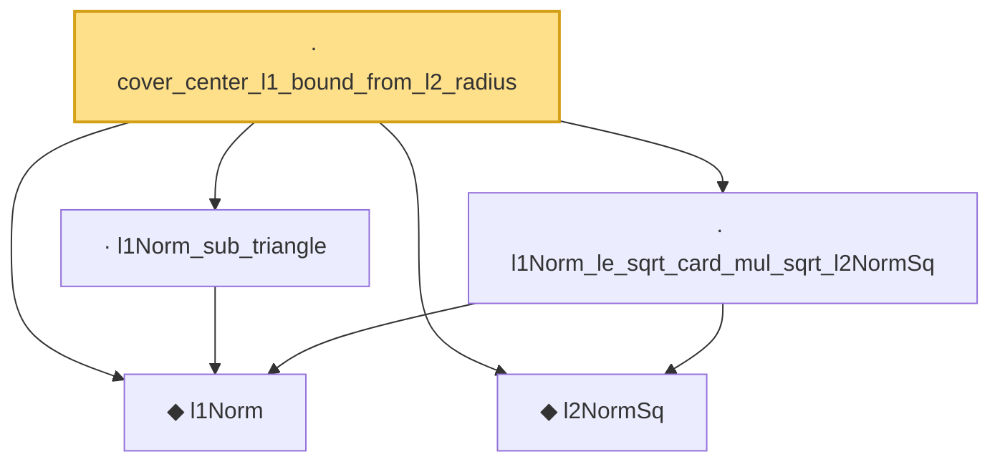

# Proof narrative — cover_center_l1_bound_from_l2_radius

Root: **cover_center_l1_bound_from_l2_radius** (lemma) `Statlib/HighDim/CovarianceMatrix/L1QuadraticProcess/RadiusFluctuation.lean:845` · topic `HighDim`
Closure: 5 declarations across 4 files. Generated from `proof_graph.json` — no files were moved.

Reading order (foundations first, headline last):

  ◆ `l1Norm` — noncomputable def · `Statlib/HighDim/Vocabulary/Norms.lean:17`  _(also used by 202: l1_linear_rademacher_complexity_bound, finite_l1_quadratic_rademacher_coord_bound, finite_l1_quadratic_rademacher_coord_energy_bound, …)_
  ◆ `l2NormSq` — noncomputable def · `Statlib/HighDim/Vocabulary/Norms.lean:13`  _(also used by 220: matrixRowVec_norm_sq, offDiagCoeffVec_norm_sq_le_frobenius, offDiagCoeffVec_norm_sq_integral_le_frobenius, …)_
  · `l1Norm_le_sqrt_card_mul_sqrt_l2NormSq` — lemma · `Statlib/HighDim/CovarianceMatrix/L1QuadraticProcess.lean:6215`  _(also used by 4: bilinear_form_entrywise_abs_le_card_mul_sqrt_l2NormSq, l2_radius_to_l1_radius, matrix_entrywise_good_to_radius_fluctuation, …)_
  · `l1Norm_sub_triangle` — lemma · `Statlib/HighDim/Geometry/CoveringNumbers.lean:1315`  _(also used by 3: matrix_entrywise_good_to_radius_fluctuation_two_caps, normalized_l1_distance_le_two_mul, normalized_sparse_euclidean_cover_to_unit_l1_cover)_
· `cover_center_l1_bound_from_l2_radius` — lemma · `Statlib/HighDim/CovarianceMatrix/L1QuadraticProcess/RadiusFluctuation.lean:845` **← headline**

## Dependency diagram

