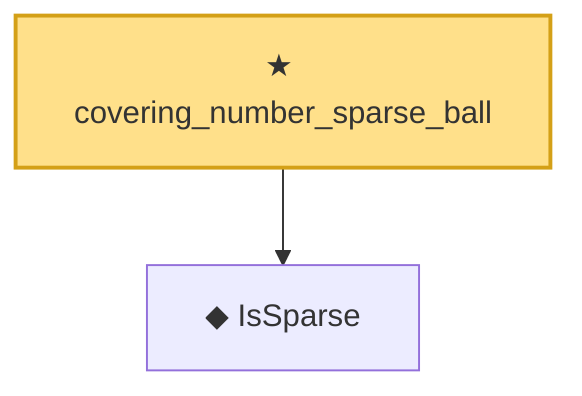

# Proof narrative — covering_number_sparse_ball

Root: **covering_number_sparse_ball** (theorem) `Statlib/HighDim/CoveringNumbers.lean:73` · topic `HighDim`
Closure: 2 declarations across 2 files. Generated from `proof_graph.json` — no files were moved.

Reading order (foundations first, headline last):

  ◆ `IsSparse` — def · `Statlib/Vocabulary/Sparse.lean:36`  _(also used by 2: log_covering_number_sparse, SatisfiesRIP)_
★ `covering_number_sparse_ball` — theorem · `Statlib/HighDim/CoveringNumbers.lean:73` **← headline**

## Dependency diagram

