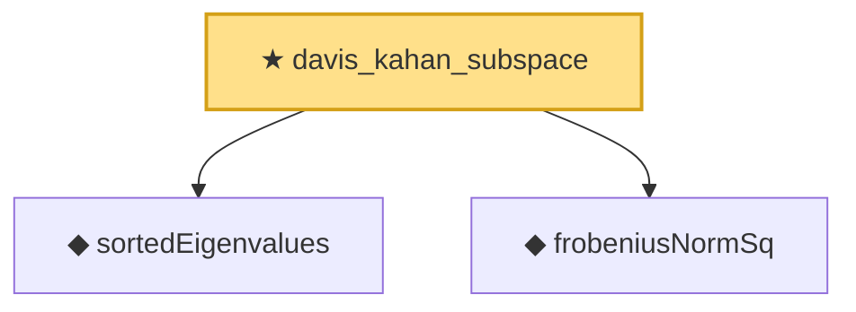

# Proof narrative — davis_kahan_subspace

Root: **davis_kahan_subspace** (theorem) `Statlib/HighDim/SpectralPerturbation/DavisKahan.lean:144` · topic `HighDim`
Closure: 3 declarations across 3 files. Generated from `proof_graph.json` — no files were moved.

Reading order (foundations first, headline last):

  ◆ `sortedEigenvalues` — noncomputable def · `Statlib/HighDim/Vocabulary/Spectral.lean:11`  _(also used by 18: sortedEigenvalues_le_of_add_posSemidef, hermitian_trace_exp_mono_of_sub_posSemidef, sortedEigenvalues_mono, …)_
  ◆ `frobeniusNormSq` — noncomputable def · `Statlib/HighDim/Vocabulary/Norms.lean:37`  _(also used by 45: diag_sq_sum_le_frobeniusNormSq, frobeniusNormSq_zeroDiagMatrix_le, frobeniusNormSq_nonneg, …)_
★ `davis_kahan_subspace` — theorem · `Statlib/HighDim/SpectralPerturbation/DavisKahan.lean:144` **← headline**

## Dependency diagram

