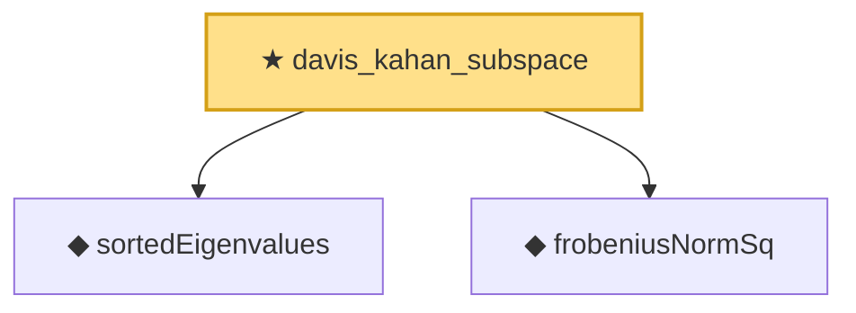

# Proof narrative — davis_kahan_subspace

Root: **davis_kahan_subspace** (theorem) `Statlib/HighDim/SpectralPerturbation.lean:135` · topic `HighDim`
Closure: 3 declarations across 2 files. Generated from `proof_graph.json` — no files were moved.

Reading order (foundations first, headline last):

  ◆ `sortedEigenvalues` — noncomputable def · `Statlib/HighDim/SpectralPerturbation.lean:40`  _(also used by 5: sortedEigenvalues_mono, sortedEigenvalues_perm, weyl_mineig_lower, …)_
  ◆ `frobeniusNormSq` — noncomputable def · `Statlib/HighDim/Basic.lean:71`  _(also used by 2: hanson_wright, hanson_wright_isotropic)_
★ `davis_kahan_subspace` — theorem · `Statlib/HighDim/SpectralPerturbation.lean:135` **← headline**

## Dependency diagram

